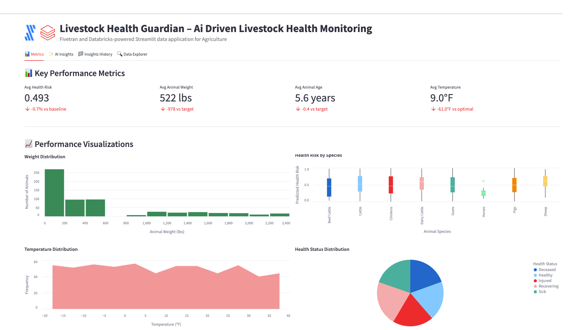

# Livestock Health Guardian – AI-driven Livestock Health Monitoring



A Fivetran and Databricks-powered Streamlit data application for Agriculture with advanced AI Agent Workflows.

## Overview

Livestock Health Guardian is an AI-driven livestock health monitoring system that helps agricultural operations automate the early detection and prevention of livestock health issues, reducing the risk of disease outbreaks and improving overall animal welfare. This Streamlit on Databricks data application helps farm managers, veterinarians, and livestock owners reduce treatment failures, decrease veterinary costs, increase animal productivity, and reduce antibiotic usage through real-time analysis of livestock health and environmental data.

The application features sophisticated AI Agent Workflows that provide transparent, step-by-step analysis of agricultural data, transforming complex livestock monitoring insights into actionable farm management strategies. Each analysis focus area operates through specialized mini-agents that simulate the decision-making process of agricultural experts.

The application utilizes a synthetic agriculture dataset that simulates data from farm management software, livestock health records, and weather monitoring systems. This synthetic data is moved into Databricks using a custom connector built with the Fivetran Connector SDK, enabling reliable and efficient data pipelines for agricultural livestock monitoring analytics.

## AI Agent Workflows

### Agent Architecture Overview

Livestock Health Guardian employs a sophisticated multi-agent architecture designed specifically for agricultural analysis. Each focus area operates through specialized AI agents that break down complex livestock monitoring tasks into transparent, sequential steps that mirror the thought processes of experienced farm managers and agricultural consultants.

### Focus Area Agents

#### Overall Performance Agent
**Business Challenge**: Farm managers manually monitor thousands of livestock across multiple locations, spending 3+ hours daily tracking health indicators, environmental conditions, and productivity metrics to prevent disease outbreaks.

**Agent Solution**: Autonomous livestock monitoring workflow that analyzes real-time health data, environmental conditions, and predictive risk scores to identify at-risk animals and generate prioritized intervention plans.

**Agent Workflow Steps**:
1. **Livestock Data Initialization** - Loading comprehensive livestock dataset with enhanced validation across animals and species
2. **Health Performance Assessment** - Advanced calculation of livestock health indicators with predictive risk analysis
3. **Agricultural Pattern Recognition** - Sophisticated identification of livestock health patterns with environmental correlation analysis
4. **AI Livestock Intelligence Processing** - Processing comprehensive farm data through selected AI model with advanced reasoning
5. **Farm Report Compilation** - Professional livestock health analysis with evidence-based recommendations and actionable insights

#### Optimization Opportunities Agent
**Business Challenge**: Veterinarians and farm managers spend 4+ hours daily manually identifying inefficiencies in vaccination schedules, treatment protocols, and resource allocation across diverse livestock operations.

**Agent Solution**: AI-powered optimization analysis that automatically detects vaccination gaps, treatment inefficiencies, and resource allocation improvements with specific implementation recommendations for farm operations.

**Agent Workflow Steps**:
1. **Farm Optimization Data Preparation** - Advanced loading of livestock management data with enhanced validation for efficiency improvement identification
2. **Livestock Management Inefficiency Detection** - Sophisticated analysis of vaccination schedules and health interventions with evidence-based inefficiency identification
3. **Agricultural Correlation Analysis** - Enhanced examination of relationships between environmental conditions, animal characteristics, and health outcomes
4. **Farm System Integration Optimization** - Comprehensive evaluation of livestock monitoring integration with existing farm management software
5. **AI Farm Optimization Intelligence** - Generating advanced livestock management recommendations using selected AI model
6. **Agricultural Strategy Finalization** - Professional farm optimization report with prioritized implementation roadmap

#### Financial Impact Agent
**Business Challenge**: Agricultural financial analysts manually calculate complex ROI metrics across livestock operations, requiring 3+ hours of financial modeling to assess veterinary costs, productivity gains, and disease prevention savings.

**Agent Solution**: Automated agricultural financial analysis that calculates comprehensive ROI, identifies cost reduction opportunities in veterinary care, and projects livestock productivity benefits with detailed farm economics forecasting.

**Agent Workflow Steps**:
1. **Agricultural Financial Data Integration** - Advanced loading of livestock economic data and farm financial metrics with enhanced validation
2. **Veterinary Cost-Benefit Calculation** - Sophisticated ROI metrics calculation with livestock productivity analysis and disease prevention cost savings
3. **Livestock Productivity Impact Assessment** - Enhanced analysis of farm revenue impact with animal welfare metrics and productivity correlation analysis
4. **Farm Resource Efficiency Analysis** - Comprehensive evaluation of resource allocation efficiency across livestock operations
5. **AI Agricultural Financial Modeling** - Advanced farm financial projections and livestock ROI calculations using selected AI model
6. **Farm Economics Report Generation** - Professional agricultural financial impact analysis with detailed livestock ROI calculations

#### Strategic Recommendations Agent
**Business Challenge**: Farm executives spend hours manually analyzing digital agriculture trends and developing strategic technology roadmaps for livestock management system advancement and competitive positioning.

**Agent Solution**: Strategic agricultural intelligence workflow that analyzes digital farming competitive advantages, identifies precision agriculture integration opportunities, and creates prioritized technology implementation roadmaps.

**Agent Workflow Steps**:
1. **Agricultural Technology Assessment** - Advanced loading of digital agriculture context with competitive positioning analysis
2. **Farm Management Competitive Advantage Analysis** - Sophisticated evaluation of competitive positioning against traditional manual livestock monitoring
3. **Precision Agriculture Integration** - Enhanced analysis of integration opportunities with IoT sensors, automated feeding systems, and precision agriculture
4. **Digital Farm Implementation Strategy** - Comprehensive development of prioritized digital agriculture roadmap with evidence-based technology adoption strategies
5. **AI Agricultural Strategic Processing** - Advanced digital farming recommendations using selected AI model with long-term competitive positioning
6. **Digital Agriculture Report Generation** - Professional digital farming roadmap with competitive analysis and livestock technology implementation plan

### Agent Execution Flow

1. **Agent Initialization** - User selects focus area and AI model, triggering specialized agent activation
2. **Data Context Loading** - Agent accesses livestock health data, environmental conditions, and farm management metrics
3. **Step-by-Step Processing** - Agent executes sequential workflow steps with real-time progress visualization
4. **Agricultural Intelligence Integration** - Selected Databricks serving endpoint processes agricultural context with specialized prompting
5. **Results Compilation** - Agent generates comprehensive agricultural analysis with actionable farm management recommendations
6. **Report Delivery** - Professional agricultural report delivered with implementation roadmap and success metrics

## Data Sources

The application is designed to work with data from major agricultural and livestock management systems:

### Agriculture Data Sources (Simulated)
- **Farm Management Software**: 
  - Granular
  - Trimble Ag
  - Climate FieldView
- **Livestock Health Records**: 
  - Zoetis
  - Merck Animal Health
  - Elanco
- **Weather Data**: 
  - The Weather Company
  - AccuWeather
  - DTN

For demonstration and development purposes, we've created a synthetic dataset that approximates these data sources and combined them into a single table exposed through an API server. This approach allows for realistic agricultural livestock monitoring analytics without using proprietary farm operations data.

## Key Features

- **AI Agent Workflows**: Transparent, step-by-step agricultural analysis through specialized mini-agents for each focus area
- **Agent Progress Visualization**: Real-time display of agent processing steps with agricultural context and completion tracking
- **Focus Area Specialization**: Dedicated agents for Overall Performance, Optimization Opportunities, Financial Impact, and Strategic Recommendations
- **Agricultural Intelligence Integration**: Seamless integration with multiple Databricks serving endpoints for specialized livestock analysis
- **AI-driven livestock health monitoring**: Leverages generative AI to analyze animal health data and automatically generate health assessments with predictive insights
- **Integration with synthetic agriculture data**: Simulates data from major farm management platforms, livestock health systems, and weather monitoring services
- **Comprehensive data application**: Visual representation of key metrics including health risk scores, animal weights, environmental conditions, and vaccination status
- **Custom Fivetran connector**: Utilizes a custom connector built with the Fivetran Connector SDK to reliably move data from the API server to Databricks

## Streamlit Data App Sections

### Metrics
- **Key Performance Indicators**: Track health risk scores, animal weights, environmental conditions, and vaccination compliance
- **Livestock Analytics**: Monitor animal health status, breed performance, and environmental impact on livestock
- **Weight Distribution**: Visualize the distribution of animal weights across the herd
- **Health Risk Analysis**: Analyze health risk scores by animal species with boxplot visualizations
- **Temperature Trends**: Track environmental temperature patterns to identify optimal conditions
- **Health Status Distribution**: Review health status distribution across livestock populations
- **Weight vs Health Risk Correlation**: Map relationships between animal weight and predicted health risks
- **Vaccination Status**: Monitor vaccination compliance across different breeds to identify gaps

### AI Insights with Agent Workflows
Generate AI-powered insights through transparent agent workflows with different focus areas:
- **Overall Performance**: Comprehensive analysis of the livestock health monitoring system through autonomous livestock monitoring workflow
- **Optimization Opportunities**: Areas where livestock health monitoring and farm management efficiency can be improved via AI-powered optimization analysis
- **Financial Impact**: Cost-benefit analysis and ROI in agriculture terms through automated agricultural financial analysis
- **Strategic Recommendations**: Long-term strategic implications for digital transformation in agriculture via strategic agricultural intelligence workflow

Each focus area includes:
- **Business Challenge Description**: Detailed explanation of the specific agricultural problem being addressed
- **Agent Solution Overview**: Description of how the AI agent workflow solves the challenge
- **Real-time Progress Tracking**: Step-by-step visualization of agent processing with agricultural context
- **Agent Execution Controls**: Start/stop controls for managing agent workflow execution
- **Professional Agricultural Reports**: Comprehensive analysis reports with implementation roadmaps

### Insights History
Access previously generated agent-driven insights for reference and comparison, including agent execution details and model selection.

### Data Explorer
Explore the underlying livestock data with pagination controls.

## Setup Instructions

### Prerequisites

#### Required Accounts & Resources
- **Databricks Workspace** with:
  - SQL Warehouse (`ts-databricks-azure-sql-serverless-demo`)
  - Model Serving Endpoints (Claude, Llama models)
  - Unity Catalog
  - Databricks Apps
- **Fivetran Account** with:
  - Databricks destination
  - Custom connector capability

#### Python Requirements
```
altair==5.5.0
databricks-sql-connector==4.0.0
pandas==2.2.3
requests==2.32.3
streamlit==1.42.0
```

### Implementation Steps

#### 1. Repository Setup
```
AGR-LIVESTOCK-HEALTH/
├── app.py
├── app.yaml
├── requirements.txt
├── .gitignore
├── README.md
└── images/
```

#### 2. Data Pipeline Setup

##### Fivetran Configuration
1. Ensure the API server hosting the synthetic agriculture data is operational
2. Configure the custom Fivetran connector (built with Fivetran Connector SDK) to connect to the API server - debug and deploy
3. Start the Fivetran sync in the Fivetran UI to move data into an `agr_records` table in your Databricks Unity Catalog
4. Verify data is being loaded correctly by checking the table in Databricks

##### Unity Catalog Setup
Set up the following structure in Unity Catalog:
- **Catalog**: `ts-catalog-demo`
- **Schema**: `agr_connector_dbx`
- **Table**: `agr_records`

#### 3. App Deployment

##### Option A: Local Development
```bash
python -m venv venv
source venv/bin/activate
pip install -r requirements.txt
streamlit run app.py
```

##### Option B: Databricks Apps Deployment via VS Code

**Sync the files**
Move to the folder with your source code:

```bash
cd agr-livestock-health
```

Sync source files into Databricks:

```bash
databricks sync --watch . /Workspace/Users/kelly.kohlleffel@fivetran.com/agr-livestock-health
```

**Deploy to Databricks Apps**

```bash
databricks apps deploy agr-livestock-health --source-code-path /Workspace/Users/kelly.kohlleffel@fivetran.com/agr-livestock-health
```

##### Option C: Databricks UI Deployment
1. Navigate to Workspace > Apps
2. Create new app
3. Upload app.py and configuration files
4. Configure resources
5. Deploy

## Data Flow

1. **Synthetic Data Creation**: A synthetic dataset approximating real agricultural livestock monitoring data sources has been created and exposed via an API server:
   - Farm Management Software: Granular, Trimble Ag, Climate FieldView
   - Livestock Health Records: Zoetis, Merck Animal Health, Elanco
   - Weather Data: The Weather Company, AccuWeather, DTN

2. **Custom Data Integration**: A custom connector built with the Fivetran Connector SDK communicates with the API server to extract the synthetic agriculture livestock data

3. **Automated Data Movement**: Fivetran manages the orchestration and scheduling of data movement from the API server into Databricks

4. **Data Loading**: The synthetic agriculture data is loaded into Databricks Unity Catalog as an `agr_records` table in a structured format ready for analysis

5. **Agent Workflow Execution**: AI agents process the agricultural data through specialized workflows, providing transparent step-by-step analysis

6. **Data Analysis**: Databricks SQL and serving endpoints analyze the data to generate insights through agent-driven processes

7. **Data Visualization**: Streamlit on Databricks presents the analyzed data in an interactive data application with agent workflow visualization

## Data Requirements

The application expects a table named `agr_records` in Unity Catalog which contains synthetic data simulating various agricultural livestock monitoring systems. This data is retrieved from an API server using a custom Fivetran connector built with the Fivetran Connector SDK:

### Livestock Data
- `record_id`
- `animal_id`
- `farm_id`
- `species`
- `breed`
- `health_status`
- `vaccination_history`
- `medication_history`
- `recommended_action`

### Performance Metrics
- `age`
- `weight`
- `predicted_health_risk`
- `temperature`
- `humidity`
- `precipitation`
- `weather_data`

### Fivetran Metadata
- `_fivetran_synced`
- `_fivetran_deleted`
- `last_updated_epoch`

## Environment Configuration

### Required Environment Variables

```yaml
# Databricks Connection
DATABRICKS_HOST: https://your-workspace.databricks.com
DATABRICKS_SQL_HTTP_PATH: /sql/1.0/warehouses/your-warehouse-id
DATABRICKS_TOKEN: your-databricks-token

# Unity Catalog Configuration
UC_CATALOG: ts-catalog-demo
UC_SCHEMA: agr_connector_dbx
UC_TABLE: agr_records

# Serving Endpoints
DBX_ENDPOINT: databricks-claude-sonnet-4
DBX_ENDPOINT_2: databricks-claude-opus-4
DBX_ENDPOINT_3: databricks-claude-3-7-sonnet
DBX_ENDPOINT_4: databricks-meta-llama-3-1-8b-instruct
DBX_ENDPOINT_5: databricks-meta-llama-3-3-70b-instruct
DBX_ENDPOINT_6: databricks-gemma-3-12b
DBX_ENDPOINT_7: databricks-llama-4-maverick

# Serving Endpoint URLs
DATABRICKS_SERVING_ENDPOINT_URL: https://your-workspace.databricks.com/serving-endpoints/databricks-claude-sonnet-4/invocations
DATABRICKS_ENDPOINT_2_URL: https://your-workspace.databricks.com/serving-endpoints/databricks-claude-opus-4/invocations
DATABRICKS_ENDPOINT_3_URL: https://your-workspace.databricks.com/serving-endpoints/databricks-claude-3-7-sonnet/invocations
DATABRICKS_ENDPOINT_4_URL: https://your-workspace.databricks.com/serving-endpoints/databricks-meta-llama-3-1-8b-instruct/invocations
DATABRICKS_ENDPOINT_5_URL: https://your-workspace.databricks.com/serving-endpoints/databricks-meta-llama-3-3-70b-instruct/invocations
DATABRICKS_ENDPOINT_6_URL: https://your-workspace.databricks.com/serving-endpoints/databricks-gemma-3-12b/invocations
DATABRICKS_ENDPOINT_7_URL: https://your-workspace.databricks.com/serving-endpoints/databricks-llama-4-maverick/invocations
```

## Benefits

- **300 fewer failed treatments per year**: 10,000 animals × 3% baseline treatment failure rate × 10% reduction = 300 fewer failed treatments/year
- **$1,200,000 in reduced veterinary costs annually**: $4,000,000 annual veterinary costs × 30% reduction = $1,200,000 savings/year
- **20% increase in animal productivity**: 80,000 animals × 20% baseline productivity rate × 20% improvement = 32,000 additional units/year
- **15% reduction in antibiotic usage**: 10,000 animals × 15% baseline antibiotic usage rate × 15% reduction = 1,500 fewer antibiotic treatments/year
- **Enhanced Decision Transparency**: Agent workflows provide clear visibility into agricultural analysis reasoning and decision-making processes
- **Accelerated Farm Management**: Automated agent processing reduces manual analysis time from hours to minutes for complex livestock assessments

## Technical Details

This application uses:
- **AI Agent Workflow Engine**: Custom agent orchestration system for transparent, step-by-step agricultural analysis
- **Multi-Agent Architecture**: Specialized agents for different agricultural focus areas with domain-specific processing
- **Agent Progress Visualization**: Real-time display of agent execution steps with agricultural context and completion tracking
- **Streamlit on Databricks** for the user interface with enhanced agent workflow displays
- **Databricks Serving Endpoints** for AI-powered insights generation through agent-managed prompting
- **Multiple AI models** including Claude 4 Sonnet, Claude 4 Opus, Claude 3.7 Sonnet, Llama 3.1/3.3, Gemma, and Llama 4 Maverick for agent intelligence
- **Databricks SQL** for data processing within agent workflows
- **Fivetran Connector SDK** for building a custom connector to retrieve synthetic agriculture livestock data from an API server
- **Custom Fivetran connector** for automated, reliable data movement into Databricks Unity Catalog

## Troubleshooting Tips

### Common Issues
1. **Connection Errors**:
   - Verify SQL warehouse is running (`ts-databricks-azure-sql-serverless-demo`)
   - Check Databricks token permissions
   - Confirm Unity Catalog access

2. **Serving Endpoint Issues**:
   - Verify all endpoint URLs in environment variables
   - Check endpoint status in Databricks
   - Review timeout settings

3. **Data Loading Issues**:
   - Confirm Unity Catalog table structure: `ts-catalog-demo.agr_connector_dbx.agr_records`
   - Check Fivetran sync status
   - Verify `_fivetran_deleted = false` filter

4. **Agent Workflow Issues**:
   - Check serving endpoint connectivity
   - Review agent progress logs
   - Verify model selection and availability

## Success Metrics

- Reduction in treatment failures
- Decrease in veterinary costs
- Increase in animal productivity
- Reduction in antibiotic usage
- **Agent Workflow Efficiency**: Time reduction from manual agricultural analysis to automated agent-driven insights
- **Decision Transparency Score**: User confidence in agricultural recommendations through visible agent reasoning
- **Agricultural Analysis Accuracy**: Improvement in livestock management decision quality through systematic agent processing

## Key Stakeholders

- Farm Managers
- Veterinarians
- Livestock Owners
- CEO of the farm or agricultural company
- **Agricultural Data Analysts**: Professionals who benefit from transparent agent workflow visibility
- **Farm Operations Teams**: Staff who implement agent-recommended livestock management strategies

## Competitive Advantage

Livestock Health Guardian differentiates itself through its use of advanced generative AI algorithms with transparent agent workflows, enabling early detection of health issues and personalized recommendations for each animal. The agent-based architecture provides unprecedented visibility into agricultural analysis reasoning, building trust and confidence in AI-driven farm management decisions. This creates a competitive advantage by reducing the risk of disease outbreaks, improving animal welfare, and providing real-time monitoring of vital signs and behavior with seamless integration to farm management software, all while maintaining complete transparency in the decision-making process.

## Long-term Evolution

In the next 3-5 years, Livestock Health Guardian will evolve to incorporate more advanced generative AI techniques and sophisticated agent architectures, including:

- **Multi-modal Agent Learning**: Agents that can process visual, sensor, and textual data from livestock monitoring systems
- **Collaborative Agent Networks**: Multiple agents working together to solve complex agricultural challenges across different farm operations
- **Adaptive Agent Intelligence**: Self-improving agents that learn from farm management outcomes and refine their analytical approaches
- **Advanced Agent Orchestration**: Sophisticated workflow management for complex, multi-step agricultural analysis processes
- **Integration with Emerging Agricultural Technologies**: Agent connectivity with IoT sensors, precision agriculture systems, automated feeding platforms, and drone monitoring for comprehensive livestock health management

The system will expand to include integration with emerging agricultural technologies like IoT sensors, precision agriculture, and automated feeding systems for comprehensive livestock health management, all orchestrated through advanced agent workflows that provide complete transparency and control over the agricultural analysis process.