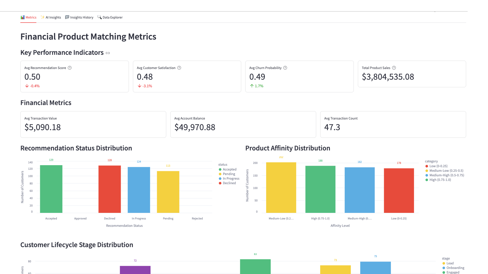

# FinMatch – AI-driven Financial Product Matching



A Fivetran and Databricks-powered Streamlit data application for Financial Services with advanced AI Agent Workflows.

## Overview

FinMatch is an AI-driven financial product matching system that helps financial institutions provide personalized product recommendations to their customers. This Streamlit on Databricks data application helps retail banking managers, product managers, and customer experience teams increase product sales, reduce customer churn, and improve customer satisfaction through real-time analysis of customer data.

The application features sophisticated AI Agent Workflows that provide transparent, step-by-step analysis of financial product matching data, transforming complex banking insights into actionable customer engagement and product recommendation strategies. Each analysis focus area operates through specialized mini-agents that simulate the decision-making process of experienced retail banking professionals and financial product strategists.

The application utilizes a synthetic financial dataset that simulates data from major core banking systems, CRM platforms, and transaction logs. This synthetic data is moved into Databricks using a custom connector built with the Fivetran Connector SDK, enabling reliable and efficient data pipelines for financial services analytics.

## AI Agent Workflows

### Agent Architecture Overview

FinMatch employs a sophisticated multi-agent architecture designed specifically for financial product matching analysis. Each focus area operates through specialized AI agents that break down complex banking recommendation tasks into transparent, sequential steps that mirror the thought processes of experienced retail banking professionals and customer relationship managers.

### Focus Area Agents

#### Overall Performance Agent
**Business Challenge**: Retail banking managers manually review thousands of customer profiles and transaction histories daily, spending 3+ hours analyzing customer data to identify appropriate financial product recommendations and cross-selling opportunities.

**Agent Solution**: Autonomous financial product matching workflow that analyzes customer transaction patterns, account balances, and lifecycle stages to generate personalized product recommendations with real-time affinity scoring and conversion predictions.

**Agent Workflow Steps**:
1. **Banking Customer Data Initialization** - Loading comprehensive customer banking dataset with enhanced validation across customers and financial product types
2. **Product Matching Performance Assessment** - Advanced calculation of financial product recommendation indicators with customer affinity analysis
3. **Banking Pattern Recognition** - Sophisticated identification of customer financial behavior patterns with transaction correlation analysis
4. **AI Banking Intelligence Processing** - Processing comprehensive banking data through selected AI model with advanced reasoning
5. **Financial Services Report Compilation** - Professional banking performance analysis with evidence-based recommendations and actionable product matching insights

#### Optimization Opportunities Agent
**Business Challenge**: Product managers spend 4+ hours daily manually identifying inefficiencies in customer segmentation, product affinity analysis, and recommendation delivery across diverse banking customer portfolios.

**Agent Solution**: AI-powered banking optimization analysis that automatically detects customer targeting gaps, product positioning inefficiencies, and recommendation delivery improvements with specific implementation strategies for core banking systems.

**Agent Workflow Steps**:
1. **Banking Optimization Data Preparation** - Advanced loading of customer financial behavior data with enhanced validation for product matching improvement identification
2. **Financial Product Inefficiency Detection** - Sophisticated analysis of customer segmentation and product affinity targeting with evidence-based inefficiency identification
3. **Banking Correlation Analysis** - Enhanced examination of relationships between customer lifecycle stages, transaction patterns, and product acceptance rates
4. **Core Banking System Integration Optimization** - Comprehensive evaluation of product matching integration with existing FIS, Fiserv, and Temenos core banking platforms
5. **AI Banking Optimization Intelligence** - Generating advanced financial product targeting recommendations using selected AI model with banking reasoning
6. **Banking Strategy Finalization** - Professional banking optimization report with prioritized implementation roadmap and financial product matching impact analysis

#### Financial Impact Agent
**Business Challenge**: Banking financial analysts manually calculate complex ROI metrics across product lines and customer segments, requiring 3+ hours of financial modeling to assess product matching impact on revenue and customer lifetime value.

**Agent Solution**: Automated banking financial analysis that calculates comprehensive ROI, identifies cross-selling revenue opportunities across customer segments, and projects customer lifetime value benefits with detailed banking portfolio forecasting.

**Agent Workflow Steps**:
1. **Banking Financial Data Integration** - Advanced loading of customer financial data and banking revenue metrics with enhanced validation across customers
2. **Banking Revenue Impact Calculation** - Sophisticated ROI metrics calculation with product sales analysis and customer lifetime value enhancement
3. **Customer Lifetime Value Impact Assessment** - Enhanced analysis of banking revenue impact with customer retention metrics and product cross-selling correlation analysis
4. **Banking Portfolio Efficiency Analysis** - Comprehensive evaluation of financial resource allocation efficiency across customer segments with product profitability optimization
5. **AI Banking Financial Modeling** - Advanced financial product revenue projections and customer value calculations using selected AI model
6. **Banking Economics Report Generation** - Professional banking financial impact analysis with detailed product recommendation ROI calculations and customer value forecasting

#### Strategic Recommendations Agent
**Business Challenge**: Chief Customer Officers spend hours manually analyzing competitive positioning and developing strategic roadmaps for personalized banking services advancement and digital transformation initiatives.

**Agent Solution**: Strategic banking intelligence workflow that analyzes competitive advantages against traditional financial institutions, identifies emerging FinTech integration opportunities with blockchain/IoT, and creates prioritized digital banking transformation roadmaps.

**Agent Workflow Steps**:
1. **Banking Technology Assessment** - Advanced loading of digital banking context with competitive positioning analysis across customers and financial products
2. **Financial Services Competitive Advantage Analysis** - Sophisticated evaluation of competitive positioning against traditional banking recommendation approaches with AI-powered personalization effectiveness
3. **Emerging FinTech Integration** - Enhanced analysis of integration opportunities with blockchain, IoT, and open banking technologies across banking data dimensions
4. **Digital Banking Strategy Development** - Comprehensive development of prioritized digital transformation roadmap with evidence-based personalized banking adoption strategies
5. **AI Banking Strategic Processing** - Advanced digital banking recommendations using selected AI model with long-term competitive positioning
6. **Digital Banking Report Generation** - Professional digital banking transformation roadmap with competitive analysis and financial product innovation plan ready for CCO executive review

### Agent Execution Flow

1. **Agent Initialization** - User selects focus area and AI model, triggering specialized agent activation
2. **Data Context Loading** - Agent accesses customer transaction data, product affinity metrics, and banking performance indicators
3. **Step-by-Step Processing** - Agent executes sequential workflow steps with real-time progress visualization
4. **Banking Intelligence Integration** - Selected Databricks serving endpoint processes financial services context with specialized prompting
5. **Results Compilation** - Agent generates comprehensive banking analysis with actionable customer engagement recommendations
6. **Report Delivery** - Professional financial services report delivered with implementation roadmap and success metrics

## Data Sources

The application is designed to work with data from major financial systems and platforms:

### Financial Data Sources (Simulated)
- **Core Banking Systems**: 
  - FIS
  - Fiserv
  - Temenos
- **Customer Relationship Management (CRM)**: 
  - Salesforce
  - HubSpot
  - Zoho
- **Customer Transaction Data**: 
  - Core banking systems
  - Transaction logs

For demonstration and development purposes, we've created a synthetic dataset that approximates these data sources and combined them into a single table exposed through an API server. This approach allows for realistic financial analytics without using protected customer information.

## Key Features

- **AI Agent Workflows**: Transparent, step-by-step financial product matching analysis through specialized mini-agents for each focus area
- **Agent Progress Visualization**: Real-time display of agent processing steps with banking context and completion tracking
- **Focus Area Specialization**: Dedicated agents for Overall Performance, Optimization Opportunities, Financial Impact, and Strategic Recommendations
- **Banking Intelligence Integration**: Seamless integration with multiple Databricks serving endpoints for specialized financial services analysis
- **AI-powered product matching engine**: Leverages generative AI to analyze customer data and provide personalized financial product recommendations
- **Integration with synthetic banking data**: Simulates data from major core banking systems, CRM platforms, and transaction logs
- **Comprehensive data application**: Visual representation of key metrics including recommendation scores, customer satisfaction, and product sales
- **Custom Fivetran connector**: Utilizes a custom connector built with the Fivetran Connector SDK to reliably move data from the API server to Databricks

## Streamlit Data App Sections

### Metrics
- **Key Performance Indicators**: Track recommendation scores, customer satisfaction, churn probability, and product sales
- **Financial Metrics**: Monitor transaction values, account balances, and transaction counts
- **Recommendation Status Distribution**: Visualize the distribution of recommendation statuses (accepted, pending, in progress, declined)
- **Product Affinity Distribution**: See the breakdown of customer product affinity levels
- **Customer Lifecycle Stage Distribution**: Analyze customer distribution across lifecycle stages
- **Product Metrics**: Review top product types and customer segments

### AI Insights with Agent Workflows
Generate AI-powered insights through transparent agent workflows with different focus areas:
- **Overall Performance**: Comprehensive analysis of the financial product matching system through autonomous financial product matching workflow
- **Optimization Opportunities**: Areas where product matching can be improved via AI-powered banking optimization analysis
- **Financial Impact**: Cost-benefit analysis and ROI in retail banking terms through automated banking financial analysis
- **Strategic Recommendations**: Long-term strategic implications for improvement via strategic banking intelligence workflow

Each focus area includes:
- **Business Challenge Description**: Detailed explanation of the specific financial services problem being addressed
- **Agent Solution Overview**: Description of how the AI agent workflow solves the challenge
- **Real-time Progress Tracking**: Step-by-step visualization of agent processing with banking context
- **Agent Execution Controls**: Start/stop controls for managing agent workflow execution
- **Professional Banking Reports**: Comprehensive analysis reports with implementation roadmaps

### Insights History
Access previously generated agent-driven insights for reference and comparison, including agent execution details and model selection.

### Data Explorer
Explore the underlying data with pagination controls.

## Setup Instructions

### Prerequisites

#### Required Accounts & Resources
- **Databricks Workspace** with:
  - SQL Warehouse
  - Model Serving Endpoints (Claude, Llama models)
  - Unity Catalog
  - Databricks Apps
- **Fivetran Account** with:
  - Databricks destination
  - Custom connector capability

#### Python Requirements
```
altair==5.5.0
databricks-sql-connector==4.0.0
pandas==2.2.3
requests==2.32.3
streamlit==1.42.0
```

### Implementation Steps

#### 1. Repository Setup
```
FINMATCH-FPR-FINSERV/
├── app.py
├── app.yaml
├── requirements.txt
├── .gitignore
├── README.md
└── images/
```

#### 2. Data Pipeline Setup

##### Fivetran Configuration
1. Ensure the API server hosting the synthetic financial data is operational
2. Configure the custom Fivetran connector (built with Fivetran Connector SDK) to connect to the API server - debug and deploy
3. Start the Fivetran sync in the Fivetran UI to move data into a `fpr_records` table in your Databricks Unity Catalog
4. Verify data is being loaded correctly by checking the table in Databricks

##### Unity Catalog Setup
Set up the following structure in Unity Catalog:
- **Catalog**: `ts-catalog-demo`
- **Schema**: `fpr_connector_dbx`
- **Table**: `fpr_records`

#### 3. App Deployment

##### Option A: Local Development
```bash
python -m venv venv
source venv/bin/activate
pip install -r requirements.txt
streamlit run app.py
```

##### Option B: Databricks Apps Deployment via VS Code

**Sync the files**
Move to the folder with your source code:

```bash
cd fpr-finserv-prodmatch
```

Sync source files into Databricks:

```bash
databricks sync --watch . /Workspace/Users/kelly.kohlleffel@fivetran.com/fpr-finserv-prodmatch
```

**Deploy to Databricks Apps**

```bash
databricks apps deploy fpr-finserv-prodmatch --source-code-path /Workspace/Users/kelly.kohlleffel@fivetran.com/fpr-finserv-prodmatch
```

##### Option C: Databricks UI Deployment
1. Navigate to Workspace > Apps
2. Create new app
3. Upload app.py and configuration files
4. Configure resources
5. Deploy

## Data Flow

1. **Synthetic Data Creation**: A synthetic dataset approximating real financial data sources has been created and exposed via an API server:
   - Core Banking Systems: FIS, Fiserv, Temenos
   - Customer Relationship Management: Salesforce, HubSpot, Zoho
   - Customer Transaction Data: Core banking systems, transaction logs

2. **Custom Data Integration**: A custom connector built with the Fivetran Connector SDK communicates with the API server to extract the synthetic financial data

3. **Automated Data Movement**: Fivetran manages the orchestration and scheduling of data movement from the API server into Databricks

4. **Data Loading**: The synthetic financial data is loaded into Databricks Unity Catalog as a `fpr_records` table in a structured format ready for analysis

5. **Agent Workflow Execution**: AI agents process the financial product matching data through specialized workflows, providing transparent step-by-step analysis

6. **Data Analysis**: Databricks SQL and serving endpoints analyze the data to generate insights through agent-driven processes

7. **Data Visualization**: Streamlit on Databricks presents the analyzed data in an interactive data application with agent workflow visualization

## Data Requirements

The application expects a table named `fpr_records` in Unity Catalog which contains synthetic data simulating various financial systems. This data is retrieved from an API server using a custom Fivetran connector built with the Fivetran Connector SDK:

### Customer Data
- `customer_id`
- `customer_name`
- `customer_email`
- `customer_segment`
- `customer_lifecycle_stage`
- `customer_lifecycle_stage_transition_date`
- `account_balance`

### Transaction Data
- `transaction_history`
- `customer_transaction_value`
- `customer_transaction_count`

### Product Data
- `product_id`
- `product_name`
- `product_type`
- `product_terms`
- `product_sales_amount`
- `product_sales_date`

### Recommendation Data
- `product_recommendation`
- `product_recommendation_date`
- `product_recommendation_status`
- `recommendation_score`

### Customer Behavior Data
- `customer_product_usage`
- `customer_product_usage_trend`
- `customer_product_interests`
- `customer_product_affinity`
- `customer_product_affinity_trend`

### Performance Metrics
- `customer_satisfaction_score`
- `customer_churn_probability`

## Environment Configuration

### Required Environment Variables

```yaml
# Databricks Connection
DATABRICKS_HOST: https://your-workspace.databricks.com
DATABRICKS_SQL_HTTP_PATH: /sql/1.0/warehouses/your-warehouse-id
DATABRICKS_TOKEN: your-databricks-token

# Unity Catalog Configuration
UC_CATALOG: ts-catalog-demo
UC_SCHEMA: fpr_connector_dbx
UC_TABLE: fpr_records

# Serving Endpoints
DBX_ENDPOINT: databricks-claude-sonnet-4
DBX_ENDPOINT_2: databricks-claude-opus-4
DBX_ENDPOINT_3: databricks-claude-3-7-sonnet
DBX_ENDPOINT_4: databricks-meta-llama-3-1-8b-instruct
DBX_ENDPOINT_5: databricks-meta-llama-3-3-70b-instruct
DBX_ENDPOINT_6: databricks-gemma-3-12b
DBX_ENDPOINT_7: databricks-llama-4-maverick

# Serving Endpoint URLs
DATABRICKS_SERVING_ENDPOINT_URL: https://your-workspace.databricks.com/serving-endpoints/databricks-claude-sonnet-4/invocations
DATABRICKS_ENDPOINT_2_URL: https://your-workspace.databricks.com/serving-endpoints/databricks-claude-opus-4/invocations
DATABRICKS_ENDPOINT_3_URL: https://your-workspace.databricks.com/serving-endpoints/databricks-claude-3-7-sonnet/invocations
DATABRICKS_ENDPOINT_4_URL: https://your-workspace.databricks.com/serving-endpoints/databricks-meta-llama-3-1-8b-instruct/invocations
DATABRICKS_ENDPOINT_5_URL: https://your-workspace.databricks.com/serving-endpoints/databricks-meta-llama-3-3-70b-instruct/invocations
DATABRICKS_ENDPOINT_6_URL: https://your-workspace.databricks.com/serving-endpoints/databricks-gemma-3-12b/invocations
DATABRICKS_ENDPOINT_7_URL: https://your-workspace.databricks.com/serving-endpoints/databricks-llama-4-maverick/invocations
```

## Benefits

- 10% increase in product sales: $1,000,000 additional sales/year
- 15% reduction in customer churn: 300 fewer churned customers/year
- 20% increase in customer satisfaction: 2,000 additional satisfied customers/year
- 5% increase in average revenue per user (ARPU): $5,000,000 additional revenue/year
- **Enhanced Banking Transparency**: Agent workflows provide clear visibility into financial product matching analysis reasoning and decision-making processes
- **Accelerated Customer Insights**: Automated agent processing reduces manual analysis time from hours to minutes for complex customer relationship assessments

## Technical Details

This application uses:
- **AI Agent Workflow Engine**: Custom agent orchestration system for transparent, step-by-step financial product matching analysis
- **Multi-Agent Architecture**: Specialized agents for different banking focus areas with domain-specific processing
- **Agent Progress Visualization**: Real-time display of agent execution steps with financial services context and completion tracking
- **Streamlit on Databricks** for the user interface with enhanced agent workflow displays
- **Databricks Serving Endpoints** for AI-powered insights generation through agent-managed prompting
- **Multiple AI models** including Claude 4 Sonnet, Claude 4 Opus, Claude 3.7 Sonnet, Llama 3.1/3.3, Gemma, and Llama 4 Maverick for agent intelligence
- **Databricks SQL** for data processing within agent workflows
- **Fivetran Connector SDK** for building a custom connector to retrieve synthetic financial data from an API server
- **Custom Fivetran connector** for automated, reliable data movement into Databricks Unity Catalog

## Troubleshooting Tips

### Common Issues
1. **Connection Errors**:
   - Verify SQL warehouse is running
   - Check Databricks token permissions
   - Confirm Unity Catalog access

2. **Serving Endpoint Issues**:
   - Verify all endpoint URLs in environment variables
   - Check endpoint status in Databricks
   - Review timeout settings

3. **Data Loading Issues**:
   - Confirm Unity Catalog table structure
   - Check Fivetran sync status
   - Verify `_fivetran_deleted = false` filter

4. **Agent Workflow Issues**:
   - Check serving endpoint connectivity
   - Review agent progress logs
   - Verify model selection and availability

## Success Metrics

- Product sales growth
- Customer churn rate reduction
- Customer satisfaction improvement
- Average revenue per user (ARPU) increase
- **Agent Workflow Efficiency**: Time reduction from manual banking analysis to automated agent-driven insights
- **Financial Product Transparency Score**: User confidence in banking recommendations through visible agent reasoning
- **Customer Relationship Analysis Accuracy**: Improvement in financial product matching decision quality through systematic agent processing

## Key Stakeholders

- Retail banking managers
- Product managers
- Customer experience managers
- Chief Customer Officer
- **Banking Data Analysts**: Professionals who benefit from transparent agent workflow visibility
- **Customer Relationship Teams**: Staff who implement agent-recommended financial product strategies

## Competitive Advantage

FinMatch uses generative AI with transparent agent workflows to analyze customer data and provide personalized product recommendations, differentiating from traditional rule-based approaches. The agent-based architecture provides unprecedented visibility into financial product matching analysis reasoning, building trust and confidence in AI-driven banking decisions. This creates a competitive advantage by delivering highly personalized financial products while maintaining complete transparency in the recommendation process.

## Long-term Evolution

In the next 3-5 years, FinMatch will evolve to incorporate more advanced generative AI techniques and sophisticated agent architectures, including:

- **Multi-modal Agent Learning**: Agents that can process financial documents, transaction patterns, and customer communication data from diverse banking channels
- **Collaborative Agent Networks**: Multiple agents working together to solve complex financial product matching challenges across different customer segments
- **Adaptive Agent Intelligence**: Self-improving agents that learn from customer outcomes and refine their analytical approaches
- **Advanced Agent Orchestration**: Sophisticated workflow management for complex, multi-step financial product analysis processes
- **Integration with Emerging Financial Technologies**: Agent connectivity with blockchain security systems, IoT transaction monitoring, and open banking APIs for comprehensive financial product matching

The system will expand to include integration with emerging technologies like blockchain and IoT to provide more personalized and secure product recommendations, all orchestrated through advanced agent workflows that provide complete transparency and control over the financial product matching analysis process.