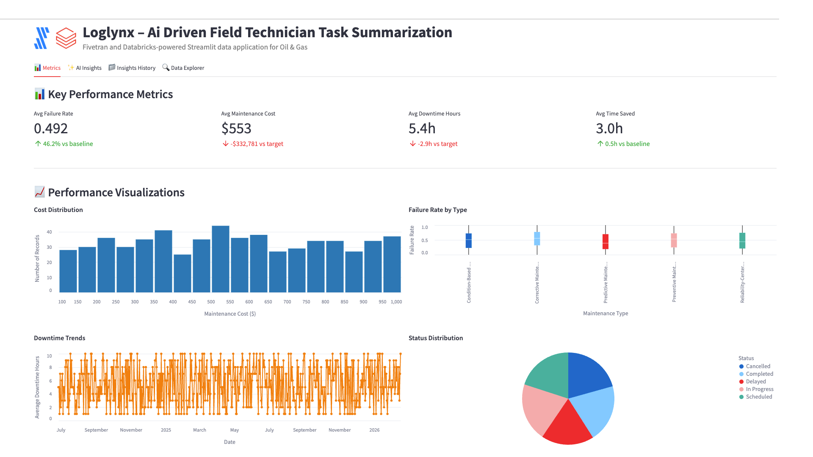

# LogLynx – AI-driven Field Technician Task Summarization



A Fivetran and Databricks-powered Streamlit data application for Oil & Gas with advanced AI Agent Workflows.

## Overview

LogLynx is an AI-driven field technician task summarization system that helps oil and gas operations automate the manual and time-consuming process of analyzing daily logs from field technicians. This Streamlit on Databricks data application helps field technicians, maintenance managers, and operations managers reduce failed treatments, decrease maintenance costs, minimize equipment downtime, and save manual summarization time through real-time analysis of field operations data.

The application features sophisticated AI Agent Workflows that provide transparent, step-by-step analysis of field operations data, transforming complex maintenance logs into actionable operational insights and predictive maintenance strategies. Each analysis focus area operates through specialized mini-agents that simulate the decision-making process of experienced field operations managers and maintenance engineers.

The application utilizes a synthetic oil and gas dataset that simulates data from field technician logs, computerized maintenance management systems (CMMS), and enterprise resource planning (ERP) systems. This synthetic data is moved into Databricks using a custom connector built with the Fivetran Connector SDK, enabling reliable and efficient data pipelines for oil and gas operations analytics.

## AI Agent Workflows

### Agent Architecture Overview

LogLynx employs a sophisticated multi-agent architecture designed specifically for oil and gas field operations analysis. Each focus area operates through specialized AI agents that break down complex maintenance and operational tasks into transparent, sequential steps that mirror the thought processes of experienced field operations professionals and maintenance engineers.

### Focus Area Agents

#### Overall Performance Agent
**Business Challenge**: Operations managers manually review hundreds of field technician logs daily, spending 3+ hours summarizing maintenance activities, equipment failures, and operational insights to identify critical issues and performance trends.

**Agent Solution**: Autonomous field operations workflow that analyzes technician logs, maintenance records, and equipment data to generate automated summaries, identify failure patterns, and produce prioritized operational insights with predictive maintenance recommendations.

**Agent Workflow Steps**:
1. **Field Operations Data Initialization** - Loading comprehensive field technician dataset with enhanced validation across logs and equipment units
2. **Maintenance Performance Assessment** - Advanced calculation of field operations indicators with failure analysis
3. **Field Operations Pattern Recognition** - Sophisticated identification of equipment performance patterns with maintenance correlation analysis
4. **AI Field Operations Intelligence Processing** - Processing comprehensive field data through selected AI model with advanced reasoning
5. **Operations Performance Report Compilation** - Professional field operations analysis with evidence-based recommendations and actionable maintenance insights

#### Optimization Opportunities Agent
**Business Challenge**: Maintenance managers spend 4+ hours daily manually identifying inefficiencies in equipment maintenance schedules, technician productivity, and resource allocation across oil and gas field operations.

**Agent Solution**: AI-powered field operations optimization analysis that automatically detects maintenance scheduling gaps, equipment performance inefficiencies, and resource allocation improvements with specific implementation recommendations for CMMS integration.

**Agent Workflow Steps**:
1. **Field Operations Optimization Data Preparation** - Advanced loading of maintenance operations data with enhanced validation for efficiency improvement identification
2. **Equipment Maintenance Inefficiency Detection** - Sophisticated analysis of maintenance scheduling and equipment performance with evidence-based inefficiency identification
3. **Field Operations Correlation Analysis** - Enhanced examination of relationships between maintenance types, failure rates, and technician productivity
4. **CMMS Integration Optimization** - Comprehensive evaluation of field operations integration with existing SAP, Oracle, and IBM Maximo CMMS systems
5. **AI Field Operations Intelligence** - Generating advanced maintenance optimization recommendations using selected AI model with oil & gas reasoning
6. **Field Operations Strategy Finalization** - Professional field operations optimization report with prioritized implementation roadmap and maintenance impact analysis

#### Financial Impact Agent
**Business Challenge**: Operations financial analysts manually calculate complex ROI metrics across maintenance activities and equipment performance, requiring 3+ hours of cost modeling to assess operational efficiency and maintenance cost optimization.

**Agent Solution**: Automated oil & gas financial analysis that calculates comprehensive ROI, identifies maintenance cost reduction opportunities across equipment categories, and projects operational efficiency benefits with detailed cost forecasting.

**Agent Workflow Steps**:
1. **Oil & Gas Financial Data Integration** - Advanced loading of field operations financial data and maintenance cost metrics with enhanced validation across operations
2. **Maintenance Cost-Benefit Calculation** - Sophisticated ROI metrics calculation with equipment maintenance analysis and operational efficiency cost savings
3. **Equipment Efficiency Impact Assessment** - Enhanced analysis of field operations revenue impact with equipment reliability metrics and maintenance cost correlation analysis
4. **Field Operations Resource Efficiency Analysis** - Comprehensive evaluation of resource allocation efficiency across maintenance activities with equipment lifecycle cost optimization
5. **AI Oil & Gas Financial Modeling** - Advanced field operations financial projections and maintenance ROI calculations using selected AI model
6. **Field Operations Economics Report Generation** - Professional oil & gas financial impact analysis with detailed maintenance ROI calculations and operational cost forecasting

#### Strategic Recommendations Agent
**Business Challenge**: Chief Operating Officers spend hours manually analyzing digital transformation opportunities and developing strategic technology roadmaps for field operations advancement and predictive maintenance implementation.

**Agent Solution**: Strategic field operations intelligence workflow that analyzes competitive advantages against traditional manual processes, identifies IoT and predictive maintenance integration opportunities, and creates prioritized digital transformation roadmaps.

**Agent Workflow Steps**:
1. **Oil & Gas Technology Assessment** - Advanced loading of field operations digital context with competitive positioning analysis across operations and equipment assets
2. **Field Operations Competitive Advantage Analysis** - Sophisticated evaluation of competitive positioning against traditional manual field operations with AI-powered log summarization effectiveness
3. **Advanced Field Technology Integration** - Enhanced analysis of integration opportunities with IoT sensors, predictive maintenance, and digital oil field technologies across operational data dimensions
4. **Digital Field Operations Strategy Development** - Comprehensive development of prioritized digital transformation roadmap with evidence-based field technology adoption strategies
5. **AI Oil & Gas Strategic Processing** - Advanced field operations strategic recommendations using selected AI model with long-term competitive positioning
6. **Digital Field Operations Report Generation** - Professional digital oil & gas transformation roadmap with competitive analysis and field technology implementation plan ready for COO executive review

### Agent Execution Flow

1. **Agent Initialization** - User selects focus area and AI model, triggering specialized agent activation
2. **Data Context Loading** - Agent accesses field technician logs, maintenance records, and equipment performance metrics
3. **Step-by-Step Processing** - Agent executes sequential workflow steps with real-time progress visualization
4. **Field Operations Intelligence Integration** - Selected Databricks serving endpoint processes oil & gas context with specialized prompting
5. **Results Compilation** - Agent generates comprehensive field operations analysis with actionable maintenance recommendations
6. **Report Delivery** - Professional oil & gas report delivered with implementation roadmap and success metrics

## Data Sources

The application is designed to work with data from major oil and gas operational systems:

### Oil & Gas Data Sources (Simulated)
- **Field Technician Logs**: 
  - SAP
  - Oracle
  - Microsoft Dynamics
- **Computerized Maintenance Management Systems (CMMS)**: 
  - IBM Maximo
  - Infor EAM
  - SAP EAM
- **Enterprise Resource Planning (ERP) Systems**: 
  - SAP
  - Oracle
  - Microsoft Dynamics

For demonstration and development purposes, we've created a synthetic dataset that approximates these data sources and combined them into a single table exposed through an API server. This approach allows for realistic oil and gas operations analytics without using proprietary field operations data.

## Key Features

- **AI Agent Workflows**: Transparent, step-by-step field operations analysis through specialized mini-agents for each focus area
- **Agent Progress Visualization**: Real-time display of agent processing steps with oil & gas context and completion tracking
- **Focus Area Specialization**: Dedicated agents for Overall Performance, Optimization Opportunities, Financial Impact, and Strategic Recommendations
- **Field Operations Intelligence Integration**: Seamless integration with multiple Databricks serving endpoints for specialized oil & gas analysis
- **AI-driven field technician log summarization**: Leverages generative AI to analyze field technician logs and automatically generate summaries with key insights
- **Integration with synthetic oil & gas data**: Simulates data from major field operations systems, CMMS platforms, and ERP systems
- **Comprehensive data application**: Visual representation of key metrics including failure rates, maintenance costs, downtime hours, and time savings
- **Custom Fivetran connector**: Utilizes a custom connector built with the Fivetran Connector SDK to reliably move data from the API server to Databricks

## Streamlit Data App Sections

### Metrics
- **Key Performance Indicators**: Track failure rates, maintenance costs, downtime hours, and time saved
- **Operational Analytics**: Monitor maintenance types, equipment performance, and technician efficiency
- **Cost Distribution**: Visualize the distribution of maintenance costs across operations
- **Failure Rate Analysis**: Analyze failure rates by maintenance type with boxplot visualizations
- **Downtime Trends**: Track downtime hours over time to identify patterns
- **Status Distribution**: Review maintenance status distribution across operations
- **Cost vs Time Correlation**: Map relationships between time saved and maintenance costs
- **Equipment Performance**: Monitor equipment failure rates to identify high-risk assets

### AI Insights with Agent Workflows
Generate AI-powered insights through transparent agent workflows with different focus areas:
- **Overall Performance**: Comprehensive analysis of the field technician log summarization system through autonomous field operations workflow
- **Optimization Opportunities**: Areas where field operations and maintenance efficiency can be improved via AI-powered field operations optimization analysis
- **Financial Impact**: Cost-benefit analysis and ROI in oil and gas operations terms through automated oil & gas financial analysis
- **Strategic Recommendations**: Long-term strategic implications for digital transformation via strategic field operations intelligence workflow

Each focus area includes:
- **Business Challenge Description**: Detailed explanation of the specific oil & gas problem being addressed
- **Agent Solution Overview**: Description of how the AI agent workflow solves the challenge
- **Real-time Progress Tracking**: Step-by-step visualization of agent processing with field operations context
- **Agent Execution Controls**: Start/stop controls for managing agent workflow execution
- **Professional Oil & Gas Reports**: Comprehensive analysis reports with implementation roadmaps

### Insights History
Access previously generated agent-driven insights for reference and comparison, including agent execution details and model selection.

### Data Explorer
Explore the underlying data with pagination controls.

## Setup Instructions

### Prerequisites

#### Required Accounts & Resources
- **Databricks Workspace** with:
  - SQL Warehouse (`ts-databricks-azure-sql-serverless-demo`)
  - Model Serving Endpoints (Claude, Llama models)
  - Unity Catalog access
  - Databricks Apps capability
- **Fivetran Account** with:
  - Databricks destination
  - Custom connector capability

#### Python Requirements
```
altair==5.5.0
databricks-sql-connector==4.0.0
pandas==2.2.3
requests==2.32.3
streamlit==1.42.0
```

### Implementation Steps

#### 1. Repository Setup
```
FTS-OG-FIELDTECH/
├── app.py
├── app.yaml
├── requirements.txt
├── .gitignore
├── README.md
└── images/
```

#### 2. Data Pipeline Setup

##### Fivetran Configuration
1. Ensure the API server hosting the synthetic oil and gas data is operational
2. Configure the custom Fivetran connector (built with Fivetran Connector SDK) to connect to the API server
3. Start the Fivetran sync to move data into a `fts_records` table in your Databricks Unity Catalog
4. Verify data is being loaded correctly by checking the table in Databricks

##### Unity Catalog Setup
Set up the following structure in Unity Catalog:
- **Catalog**: `ts-catalog-demo`
- **Schema**: `fts_connector_dbx`
- **Table**: `fts_records`

#### 3. Databricks Serving Endpoints Configuration

Ensure the following serving endpoints are deployed and active:
- **Primary**: `databricks-claude-sonnet-4`
- **Secondary**: `databricks-claude-opus-4`
- **Tertiary**: `databricks-claude-3-7-sonnet`
- **Llama Models**: `databricks-meta-llama-3-1-8b-instruct`, `databricks-meta-llama-3-3-70b-instruct`
- **Alternative Models**: `databricks-gemma-3-12b`, `databricks-llama-4-maverick`

#### 4. App Deployment

##### Option A: Local Development
```bash
python -m venv venv
source venv/bin/activate
pip install -r requirements.txt
streamlit run app.py
```

##### Option B: Databricks Apps Deployment via VS Code

**Sync the files**
Move to the folder with your source code:

```bash
cd fts-og-fieldtech
```

Sync source files into Databricks:

```bash
databricks sync --watch . /Workspace/Users/kelly.kohlleffel@fivetran.com/fts-og-fieldtech
```

**Deploy to Databricks Apps**

```bash
databricks apps deploy fts-og-fieldtech --source-code-path /Workspace/Users/kelly.kohlleffel@fivetran.com/fts-og-fieldtech
```

##### Option C: Databricks UI Deployment
1. Navigate to Workspace > Apps
2. Create new app
3. Upload app.py and configuration files
4. Configure resources
5. Deploy

## Data Flow

1. **Synthetic Data Creation**: A synthetic dataset approximating real oil and gas operational data sources has been created and exposed via an API server:
   - Field Technician Logs: SAP, Oracle, Microsoft Dynamics
   - Computerized Maintenance Management Systems: IBM Maximo, Infor EAM, SAP EAM
   - Enterprise Resource Planning Systems: SAP, Oracle, Microsoft Dynamics

2. **Custom Data Integration**: A custom connector built with the Fivetran Connector SDK communicates with the API server to extract the synthetic oil and gas operations data

3. **Automated Data Movement**: Fivetran manages the orchestration and scheduling of data movement from the API server into Databricks

4. **Data Loading**: The synthetic oil and gas data is loaded into Databricks Unity Catalog as a `fts_records` table in a structured format ready for analysis

5. **Agent Workflow Execution**: AI agents process the field operations data through specialized workflows, providing transparent step-by-step analysis

6. **Data Analysis**: Databricks SQL and serving endpoints analyze the data to generate insights through agent-driven processes

7. **Data Visualization**: Streamlit on Databricks presents the analyzed data in an interactive data application with agent workflow visualization

## Data Requirements

The application expects a table named `fts_records` in Unity Catalog which contains synthetic data simulating various oil and gas operational systems. This data is retrieved from an API server using a custom Fivetran connector built with the Fivetran Connector SDK:

### Field Operations Data
- `record_id`
- `log_date`
- `technician_id`
- `log_description`
- `equipment_id`
- `maintenance_type`
- `maintenance_status`
- `erp_order_id`
- `customer_id`
- `summarized_log`

### Performance Metrics
- `failure_rate`
- `maintenance_cost`
- `downtime_hours`
- `summarization_time_saved`

### Fivetran System Fields
- `_fivetran_synced`
- `_fivetran_deleted`
- `last_updated_epoch`

## Environment Configuration

### Required Environment Variables

```yaml
# Databricks Connection
DATABRICKS_HOST: https://your-workspace.databricks.com
DATABRICKS_SQL_HTTP_PATH: /sql/1.0/warehouses/your-warehouse-id
DATABRICKS_TOKEN: your-databricks-token

# Serving Endpoint URLs
DATABRICKS_SERVING_ENDPOINT_URL: https://your-workspace.databricks.com/serving-endpoints/databricks-claude-sonnet-4/invocations
DATABRICKS_ENDPOINT_2_URL: https://your-workspace.databricks.com/serving-endpoints/databricks-claude-opus-4/invocations
DATABRICKS_ENDPOINT_3_URL: https://your-workspace.databricks.com/serving-endpoints/databricks-claude-3-7-sonnet/invocations
DATABRICKS_ENDPOINT_4_URL: https://your-workspace.databricks.com/serving-endpoints/databricks-meta-llama-3-1-8b-instruct/invocations
DATABRICKS_ENDPOINT_5_URL: https://your-workspace.databricks.com/serving-endpoints/databricks-meta-llama-3-3-70b-instruct/invocations
DATABRICKS_ENDPOINT_6_URL: https://your-workspace.databricks.com/serving-endpoints/databricks-gemma-3-12b/invocations
DATABRICKS_ENDPOINT_7_URL: https://your-workspace.databricks.com/serving-endpoints/databricks-llama-4-maverick/invocations
```

### App Resources Configuration

The application is configured to use the following Databricks resources:

| Key | Type | Details |
|-----|------|---------|
| sql_warehouse | SQL Warehouse | ts-databricks-azure-sql-serverless-demo |
| secret | Secret | Key: databricks-token-secret |
| serving_endpoint | Serving Endpoint | databricks-claude-sonnet-4 |
| serving_endpoint-2 | Serving Endpoint | databricks-claude-opus-4 |
| serving_endpoint-3 | Serving Endpoint | databricks-claude-3-7-sonnet |
| serving_endpoint-4 | Serving Endpoint | databricks-meta-llama-3-1-8b-instruct |
| serving_endpoint-5 | Serving Endpoint | databricks-meta-llama-3-3-70b-instruct |
| serving_endpoint-6 | Serving Endpoint | databricks-gemma-3-12b |
| serving_endpoint-7 | Serving Endpoint | databricks-llama-4-maverick |

## Benefits

- **300 fewer failed treatments per year**: 10,000 field technician logs × 3% baseline failure rate × 15% reduction = 300 fewer failed treatments/year
- **$1,200,000 in maintenance cost savings annually**: $4,000,000 annual maintenance costs × 30% reduction = $1,200,000 savings/year
- **25% reduction in maintenance downtime**: 100 hours of downtime/month × 12 months/year × 25% reduction = 300 hours saved/year
- **90% reduction in manual summarization time**: 100 hours/month × 12 months/year × 90% reduction = 1,200 hours saved/year
- **Enhanced Operational Transparency**: Agent workflows provide clear visibility into field operations analysis reasoning and decision-making processes
- **Accelerated Maintenance Insights**: Automated agent processing reduces manual analysis time from hours to minutes for complex equipment assessments

## Technical Details

This application uses:
- **AI Agent Workflow Engine**: Custom agent orchestration system for transparent, step-by-step field operations analysis
- **Multi-Agent Architecture**: Specialized agents for different oil & gas focus areas with domain-specific processing
- **Agent Progress Visualization**: Real-time display of agent execution steps with field operations context and completion tracking
- **Streamlit on Databricks** for the user interface with enhanced agent workflow displays
- **Databricks Serving Endpoints** for AI-powered insights generation through agent-managed prompting
- **Multiple AI models** including Claude 4 Sonnet, Claude 4 Opus, Claude 3.7 Sonnet, Llama 3.1/3.3, Gemma, and Llama 4 Maverick for agent intelligence
- **Databricks SQL** for data processing within agent workflows
- **Unity Catalog** for centralized data governance and access control
- **Fivetran Connector SDK** for building a custom connector to retrieve synthetic oil and gas operations data from an API server
- **Custom Fivetran connector** for automated, reliable data movement into Databricks Unity Catalog

## Troubleshooting Tips

### Common Issues
1. **Connection Errors**:
   - Verify SQL warehouse is running
   - Check Databricks token permissions
   - Confirm Unity Catalog access

2. **Serving Endpoint Issues**:
   - Verify all endpoint URLs in environment variables
   - Check endpoint status in Databricks
   - Review timeout settings

3. **Data Loading Issues**:
   - Confirm Unity Catalog table structure
   - Check Fivetran sync status
   - Verify `_fivetran_deleted = false` filter

4. **Agent Workflow Issues**:
   - Check serving endpoint connectivity
   - Review agent progress logs
   - Verify model selection and availability

### Data Schema Validation
The application expects the following data types in the `fts_records` table:

| Column | Data Type | Description |
|--------|-----------|-------------|
| record_id | String | Unique identifier for each record |
| _fivetran_synced | Date | Fivetran sync timestamp |
| summarization_time_saved | Integer | Hours saved through automation |
| maintenance_status | String | Current status of maintenance |
| summarized_log | String | AI-generated summary |
| maintenance_type | String | Type of maintenance performed |
| _fivetran_deleted | Boolean | Soft delete flag |
| last_updated_epoch | Integer | Unix timestamp of last update |
| technician_id | String | Field technician identifier |
| erp_order_id | String | ERP system order ID |
| failure_rate | Float | Equipment failure rate |
| log_description | String | Original technician log |
| log_date | String | Date of log entry |
| downtime_hours | Integer | Equipment downtime duration |
| customer_id | String | Customer identifier |
| equipment_id | String | Equipment identifier |
| maintenance_cost | Float | Cost of maintenance activity |

## Success Metrics

- Reduction in failed treatments
- Maintenance cost savings
- Maintenance downtime reduction
- Time saved in manual summarization
- **Agent Workflow Efficiency**: Time reduction from manual field operations analysis to automated agent-driven insights
- **Field Operations Transparency Score**: User confidence in maintenance recommendations through visible agent reasoning
- **Equipment Analysis Accuracy**: Improvement in maintenance decision quality through systematic agent processing

## Key Stakeholders

- Field Technicians
- Maintenance Managers
- Operations Managers
- Chief Operating Officer (COO)
- **Field Operations Analysts**: Professionals who benefit from transparent agent workflow visibility
- **Maintenance Teams**: Staff who implement agent-recommended equipment maintenance strategies

## Competitive Advantage

LogLynx differentiates itself by leveraging generative AI with transparent agent workflows to automate the summarization process, reducing manual labor and increasing the speed of insights. The agent-based architecture provides unprecedented visibility into field operations analysis reasoning, building trust and confidence in AI-driven maintenance decisions. This creates a competitive advantage by enabling faster decision-making and improved operational efficiency in oil and gas field operations while maintaining complete transparency in the analysis process.

## Long-term Evolution

In the next 3-5 years, LogLynx will evolve to incorporate more advanced generative AI techniques and sophisticated agent architectures, including:

- **Multi-modal Agent Learning**: Agents that can process equipment images, sensor data, and maintenance documentation from diverse field systems
- **Collaborative Agent Networks**: Multiple agents working together to solve complex field operations challenges across different equipment categories
- **Adaptive Agent Intelligence**: Self-improving agents that learn from maintenance outcomes and refine their analytical approaches
- **Advanced Agent Orchestration**: Sophisticated workflow management for complex, multi-step field operations analysis processes
- **Integration with Emerging Oil & Gas Technologies**: Agent connectivity with IoT sensors, predictive maintenance algorithms, and digital oil field platforms for comprehensive operational intelligence

The system will expand to include integration with emerging technologies like IoT sensors and predictive maintenance systems, all orchestrated through advanced agent workflows that provide complete transparency and control over the field operations analysis process.