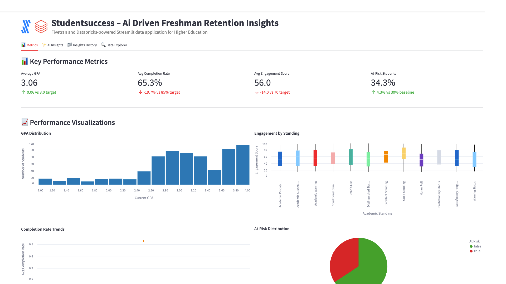

# StudentSuccess – AI-driven Freshman Retention Insights



A Fivetran and Databricks-powered Streamlit data application for Higher Education with advanced AI Agent Workflows.

## Overview

StudentSuccess is an AI-driven freshman retention insights system that helps higher education institutions automate the manual and time-consuming process of analyzing student academic performance and engagement data. This Streamlit on Databricks data application helps academic advisors, student success coordinators, and enrollment management teams improve retention rates, reduce dropout costs, minimize intervention time, and increase student success through real-time analysis of academic and engagement data.

The application features sophisticated AI Agent Workflows that provide transparent, step-by-step analysis of student success data, transforming complex academic records into actionable retention insights and predictive intervention strategies. Each analysis focus area operates through specialized mini-agents that simulate the decision-making process of experienced academic advisors and student success professionals.

The application utilizes a synthetic higher education dataset that simulates data from student information systems (SIS), learning management systems (LMS), and academic integrity systems. This synthetic data is moved into Databricks using a custom connector built with the Fivetran Connector SDK, enabling reliable and efficient data pipelines for higher education analytics.

## AI Agent Workflows

### Agent Architecture Overview

StudentSuccess employs a sophisticated multi-agent architecture designed specifically for higher education student success analysis. Each focus area operates through specialized AI agents that break down complex academic and retention tasks into transparent, sequential steps that mirror the thought processes of experienced academic advisors and student success professionals.

### Focus Area Agents

#### Overall Performance Agent
**Business Challenge**: Academic advisors manually review hundreds of student records daily, spending 3+ hours analyzing GPA trends, engagement metrics, and early warning indicators to identify at-risk freshmen and develop retention strategies.

**Agent Solution**: Autonomous student success workflow that analyzes academic performance, engagement patterns, and behavioral data to generate automated at-risk assessments, identify retention patterns, and produce prioritized intervention recommendations with predictive analytics.

**Agent Workflow Steps**:
1. **Student Success Data Initialization** - Loading comprehensive student academic dataset with enhanced validation across student records and academic programs
2. **Academic Performance Assessment** - Advanced calculation of retention indicators with GPA analysis
3. **Student Engagement Pattern Recognition** - Sophisticated identification of engagement performance patterns with academic correlation analysis
4. **AI Student Success Intelligence Processing** - Processing comprehensive student data through selected AI model with advanced reasoning
5. **Academic Performance Report Compilation** - Professional student success analysis with evidence-based recommendations and actionable retention insights

#### Optimization Opportunities Agent
**Business Challenge**: Student success coordinators spend 4+ hours daily manually identifying inefficiencies in academic advising, engagement tracking, and intervention strategies across diverse student populations and academic programs.

**Agent Solution**: AI-powered student success optimization analysis that automatically detects advising gaps, engagement performance inefficiencies, and intervention allocation improvements with specific implementation recommendations for SIS and LMS integration.

**Agent Workflow Steps**:
1. **Student Success Optimization Data Preparation** - Advanced loading of academic performance data with enhanced validation for retention improvement identification
2. **Academic Advising Inefficiency Detection** - Sophisticated analysis of advising scheduling and student engagement with evidence-based inefficiency identification
3. **Student Success Correlation Analysis** - Enhanced examination of relationships between academic standing, engagement scores, and intervention effectiveness
4. **SIS/LMS Integration Optimization** - Comprehensive evaluation of student success integration with existing Banner, Canvas, and Turnitin systems
5. **AI Student Success Intelligence** - Generating advanced retention optimization recommendations using selected AI model with higher education reasoning
6. **Student Success Strategy Finalization** - Professional student success optimization report with prioritized implementation roadmap and retention impact analysis

#### Financial Impact Agent
**Business Challenge**: Enrollment financial analysts manually calculate complex ROI metrics across retention initiatives and student success programs, requiring 3+ hours of cost modeling to assess tuition revenue protection and intervention cost optimization.

**Agent Solution**: Automated higher education financial analysis that calculates comprehensive retention ROI, identifies tuition revenue protection opportunities across student segments, and projects enrollment efficiency benefits with detailed cost forecasting.

**Agent Workflow Steps**:
1. **Higher Education Financial Data Integration** - Advanced loading of student success financial data and tuition revenue metrics with enhanced validation across students
2. **Retention Revenue Calculation** - Sophisticated ROI metrics calculation with tuition revenue analysis and retention cost optimization
3. **Student Success Investment Assessment** - Enhanced analysis of retention revenue impact with student success metrics and tuition revenue correlation analysis
4. **Academic Resource Efficiency Analysis** - Comprehensive evaluation of resource allocation efficiency across academic programs with student lifecycle revenue optimization
5. **AI Higher Education Financial Modeling** - Advanced student success financial projections and retention ROI calculations using selected AI model
6. **Student Success Economics Report Generation** - Professional higher education financial impact analysis with detailed retention ROI calculations and tuition revenue forecasting

#### Strategic Recommendations Agent
**Business Challenge**: Provosts and VPs of Student Affairs spend hours manually analyzing digital transformation opportunities and developing strategic technology roadmaps for student success advancement and predictive analytics implementation.

**Agent Solution**: Strategic student success intelligence workflow that analyzes competitive advantages against traditional reactive methods, identifies predictive analytics and personalized learning integration opportunities, and creates prioritized digital transformation roadmaps.

**Agent Workflow Steps**:
1. **Higher Education Technology Assessment** - Advanced loading of student success digital context with competitive positioning analysis across students and academic programs
2. **Student Success Competitive Advantage Analysis** - Sophisticated evaluation of competitive positioning against traditional reactive academic advising with AI-powered retention prediction effectiveness
3. **Advanced Academic Technology Integration** - Enhanced analysis of integration opportunities with predictive analytics, personalized learning, and digital student success technologies across academic data dimensions
4. **Digital Student Success Strategy Development** - Comprehensive development of prioritized digital transformation roadmap with evidence-based academic technology adoption strategies
5. **AI Higher Education Strategic Processing** - Advanced student success strategic recommendations using selected AI model with long-term competitive positioning
6. **Digital Academic Transformation Report Generation** - Professional digital higher education transformation roadmap with competitive analysis and academic technology implementation plan ready for Provost executive review

### Agent Execution Flow

1. **Agent Initialization** - User selects focus area and AI model, triggering specialized agent activation
2. **Data Context Loading** - Agent accesses student academic records, engagement metrics, and intervention history
3. **Step-by-Step Processing** - Agent executes sequential workflow steps with real-time progress visualization
4. **Student Success Intelligence Integration** - Selected Databricks serving endpoint processes higher education context with specialized prompting
5. **Results Compilation** - Agent generates comprehensive student success analysis with actionable retention recommendations
6. **Report Delivery** - Professional higher education report delivered with implementation roadmap and success metrics

## Data Sources

The application is designed to work with data from major higher education operational systems:

### Higher Education Data Sources (Simulated)
- **Student Information Systems**: 
  - Banner
  - PeopleSoft
  - Colleague
- **Learning Management Systems**: 
  - Canvas
  - Blackboard
  - Moodle
- **Academic Integrity Systems**: 
  - Turnitin
  - SafeAssign
- **Engagement Analytics**: 
  - BrightBytes
  - Civitas Learning

For demonstration and development purposes, we've created a synthetic dataset that approximates these data sources and combined them into a single table exposed through an API server. This approach allows for realistic higher education analytics without using proprietary student data.

## Key Features

- **AI Agent Workflows**: Transparent, step-by-step student success analysis through specialized mini-agents for each focus area
- **Agent Progress Visualization**: Real-time display of agent processing steps with higher education context and completion tracking
- **Focus Area Specialization**: Dedicated agents for Overall Performance, Optimization Opportunities, Financial Impact, and Strategic Recommendations
- **Student Success Intelligence Integration**: Seamless integration with multiple Databricks serving endpoints for specialized higher education analysis
- **AI-driven student retention insights**: Leverages generative AI to analyze student academic and engagement data and automatically generate retention predictions with key insights
- **Integration with synthetic higher education data**: Simulates data from major SIS platforms, LMS systems, and academic integrity tools
- **Comprehensive data application**: Visual representation of key metrics including GPA trends, completion rates, engagement scores, and at-risk indicators
- **Custom Fivetran connector**: Utilizes a custom connector built with the Fivetran Connector SDK to reliably move data from the API server to Databricks

## Streamlit Data App Sections

### Metrics
- **Key Performance Indicators**: Track GPA averages, completion rates, engagement scores, and at-risk student percentages
- **Academic Analytics**: Monitor academic standings, major performance, and intervention effectiveness
- **GPA Distribution**: Visualize the distribution of student GPAs across the institution
- **Engagement Analysis**: Analyze engagement scores by academic standing with boxplot visualizations
- **Completion Rate Trends**: Track completion rates over time to identify patterns
- **At-Risk Distribution**: Review at-risk vs. not at-risk student distribution
- **Aid vs GPA Correlation**: Map relationships between financial aid and academic performance
- **Major Performance**: Monitor average GPA by major to identify high and low-performing programs

### AI Insights with Agent Workflows
Generate AI-powered insights through transparent agent workflows with different focus areas:
- **Overall Performance**: Comprehensive analysis of the student success prediction system through autonomous student success workflow
- **Optimization Opportunities**: Areas where academic advising and retention efforts can be improved via AI-powered student success optimization analysis
- **Financial Impact**: Cost-benefit analysis and ROI in higher education terms through automated higher education financial analysis
- **Strategic Recommendations**: Long-term strategic implications for digital transformation via strategic student success intelligence workflow

Each focus area includes:
- **Business Challenge Description**: Detailed explanation of the specific higher education problem being addressed
- **Agent Solution Overview**: Description of how the AI agent workflow solves the challenge
- **Real-time Progress Tracking**: Step-by-step visualization of agent processing with higher education context
- **Agent Execution Controls**: Start/stop controls for managing agent workflow execution
- **Professional Higher Education Reports**: Comprehensive analysis reports with implementation roadmaps

### Insights History
Access previously generated agent-driven insights for reference and comparison, including agent execution details and model selection.

### Data Explorer
Explore the underlying data with pagination controls.

## Setup Instructions

### Prerequisites

#### Required Accounts & Resources
- **Databricks Workspace** with:
  - SQL Warehouse (ts-databricks-azure-sql-serverless-demo)
  - Model Serving Endpoints (Claude, Llama models)
  - Unity Catalog
  - Databricks Apps
- **Fivetran Account** with:
  - Databricks destination
  - Custom connector capability

#### Python Requirements
```
altair==5.5.0
databricks-sql-connector==4.0.0
pandas==2.2.3
requests==2.32.3
streamlit==1.42.0
```

### Implementation Steps

#### 1. Repository Setup
```
HED-HIGHERED-STUDENTSUCCESS/
├── app.py
├── app.yaml
├── requirements.txt
├── .gitignore
├── README.md
└── images/
```

#### 2. Data Pipeline Setup

##### Fivetran Configuration
1. Ensure the API server hosting the synthetic higher education data is operational
2. Configure the custom Fivetran connector (built with Fivetran Connector SDK) to connect to the API server
3. Start the Fivetran sync to move data into a `hed_records` table in your Databricks Unity Catalog
4. Verify data is being loaded correctly by checking the table in Databricks

##### Unity Catalog Setup
Set up the following structure in Unity Catalog:
- **Catalog**: `ts-catalog-demo`
- **Schema**: `hed_connector_dbx`
- **Table**: `hed_records`

#### 3. App Deployment

##### Option A: Local Development
```bash
python -m venv venv
source venv/bin/activate
pip install -r requirements.txt
streamlit run app.py
```

##### Option B: Databricks Apps Deployment via VS Code

**Sync the files**
Move to the folder with your source code:

```bash
cd hed-highered-studentsuccess
```

Sync source files into Databricks:

```bash
databricks sync --watch . /Workspace/Users/kelly.kohlleffel@fivetran.com/hed-highered-studentsuccess
```

**Deploy to Databricks Apps**

```bash
databricks apps deploy hed-highered-studentsuccess --source-code-path /Workspace/Users/kelly.kohlleffel@fivetran.com/hed-highered-studentsuccess
```

##### Option C: Databricks UI Deployment
1. Navigate to Workspace > Apps
2. Create new app
3. Upload app.py and configuration files
4. Configure resources
5. Deploy

## Data Flow

1. **Synthetic Data Creation**: A synthetic dataset approximating real higher education data sources has been created and exposed via an API server:
   - Student Information Systems: Banner, PeopleSoft, Colleague
   - Learning Management Systems: Canvas, Blackboard, Moodle
   - Academic Integrity Systems: Turnitin, SafeAssign
   - Engagement Analytics: BrightBytes, Civitas Learning

2. **Custom Data Integration**: A custom connector built with the Fivetran Connector SDK communicates with the API server to extract the synthetic higher education data

3. **Automated Data Movement**: Fivetran manages the orchestration and scheduling of data movement from the API server into Databricks

4. **Data Loading**: The synthetic higher education data is loaded into Databricks Unity Catalog as a `hed_records` table in a structured format ready for analysis

5. **Agent Workflow Execution**: AI agents process the student success data through specialized workflows, providing transparent step-by-step analysis

6. **Data Analysis**: Databricks SQL and serving endpoints analyze the data to generate insights through agent-driven processes

7. **Data Visualization**: Streamlit on Databricks presents the analyzed data in an interactive data application with agent workflow visualization

## Data Requirements

The application expects a table named `hed_records` in Unity Catalog which contains synthetic data simulating various higher education operational systems. This data is retrieved from an API server using a custom Fivetran connector built with the Fivetran Connector SDK:

### Student Academic Data
- `RECORD_ID`
- `STUDENT_ID`
- `ENROLLMENT_DATE`
- `ACADEMIC_STANDING`
- `CURRENT_GPA`
- `CREDIT_HOURS_ATTEMPTED`
- `CREDIT_HOURS_EARNED`
- `MAJOR_CODE`
- `ADVISOR_ID`
- `FINANCIAL_AID_AMOUNT`

### Engagement Metrics
- `LAST_LOGIN_DATE`
- `TOTAL_COURSE_VIEWS`
- `ASSIGNMENT_SUBMISSIONS`
- `DISCUSSION_POSTS`
- `AVG_ASSIGNMENT_SCORE`
- `COURSE_COMPLETION_RATE`
- `PLAGIARISM_INCIDENTS`
- `WRITING_QUALITY_SCORE`
- `ENGAGEMENT_SCORE`
- `AT_RISK_FLAG`
- `INTERVENTION_COUNT`
- `LAST_UPDATED`

## Environment Configuration

### Required Environment Variables

```yaml
# Databricks Connection
DATABRICKS_HOST: https://your-workspace.databricks.com
DATABRICKS_SQL_HTTP_PATH: /sql/1.0/warehouses/ts-databricks-azure-sql-serverless-demo
DATABRICKS_TOKEN: your-databricks-token

# Unity Catalog Configuration
UC_CATALOG: ts-catalog-demo
UC_SCHEMA: hed_connector_dbx
UC_TABLE: hed_records

# Serving Endpoints
DBX_ENDPOINT: databricks-claude-sonnet-4
DBX_ENDPOINT_2: databricks-claude-opus-4
DBX_ENDPOINT_3: databricks-claude-3-7-sonnet
DBX_ENDPOINT_4: databricks-meta-llama-3-1-8b-instruct
DBX_ENDPOINT_5: databricks-meta-llama-3-3-70b-instruct
DBX_ENDPOINT_6: databricks-gemma-3-12b
DBX_ENDPOINT_7: databricks-llama-4-maverick

# Serving Endpoint URLs
DATABRICKS_SERVING_ENDPOINT_URL: https://your-workspace.databricks.com/serving-endpoints/databricks-claude-sonnet-4/invocations
DATABRICKS_ENDPOINT_2_URL: https://your-workspace.databricks.com/serving-endpoints/databricks-claude-opus-4/invocations
DATABRICKS_ENDPOINT_3_URL: https://your-workspace.databricks.com/serving-endpoints/databricks-claude-3-7-sonnet/invocations
DATABRICKS_ENDPOINT_4_URL: https://your-workspace.databricks.com/serving-endpoints/databricks-meta-llama-3-1-8b-instruct/invocations
DATABRICKS_ENDPOINT_5_URL: https://your-workspace.databricks.com/serving-endpoints/databricks-meta-llama-3-3-70b-instruct/invocations
DATABRICKS_ENDPOINT_6_URL: https://your-workspace.databricks.com/serving-endpoints/databricks-gemma-3-12b/invocations
DATABRICKS_ENDPOINT_7_URL: https://your-workspace.databricks.com/serving-endpoints/databricks-llama-4-maverick/invocations
```

## Benefits

- **15% improvement in freshman retention rate**: 1,000 freshman students × 85% baseline retention × 15% improvement = 127 additional retained students/year
- **$2,500,000 in tuition revenue protection annually**: 127 additional retained students × $20,000 average tuition = $2,540,000 revenue protection/year
- **40% reduction in time to identify at-risk students**: Traditional 8-week identification → 5-week identification = 3-week earlier intervention
- **90% accuracy in at-risk student prediction**: Improved from 65% manual identification accuracy to 90% AI-powered accuracy
- **Enhanced Academic Transparency**: Agent workflows provide clear visibility into student success analysis reasoning and decision-making processes
- **Accelerated Retention Insights**: Automated agent processing reduces manual analysis time from hours to minutes for complex student assessments

## Technical Details

This application uses:
- **AI Agent Workflow Engine**: Custom agent orchestration system for transparent, step-by-step student success analysis
- **Multi-Agent Architecture**: Specialized agents for different higher education focus areas with domain-specific processing
- **Agent Progress Visualization**: Real-time display of agent execution steps with higher education context and completion tracking
- **Streamlit on Databricks** for the user interface with enhanced agent workflow displays
- **Databricks Serving Endpoints** for AI-powered insights generation through agent-managed prompting
- **Multiple AI models** including Claude 4 Sonnet, Claude 4 Opus, Claude 3.7 Sonnet, Llama 3.1/3.3, Gemma, and Llama 4 Maverick for agent intelligence
- **Databricks SQL** for data processing within agent workflows
- **Fivetran Connector SDK** for building a custom connector to retrieve synthetic higher education data from an API server
- **Custom Fivetran connector** for automated, reliable data movement into Databricks Unity Catalog

## Troubleshooting Tips

### Common Issues
1. **Connection Errors**:
   - Verify SQL warehouse is running (ts-databricks-azure-sql-serverless-demo)
   - Check Databricks token permissions
   - Confirm Unity Catalog access

2. **Serving Endpoint Issues**:
   - Verify all endpoint URLs in environment variables
   - Check endpoint status in Databricks
   - Review timeout settings

3. **Data Loading Issues**:
   - Confirm Unity Catalog table structure (`ts-catalog-demo`.hed_connector_dbx.hed_records)
   - Check Fivetran sync status
   - Verify `_fivetran_deleted = false` filter

4. **Agent Workflow Issues**:
   - Check serving endpoint connectivity
   - Review agent progress logs
   - Verify model selection and availability

## Success Metrics

- Freshman retention rate improvement
- Early identification accuracy
- Intervention effectiveness
- Time to risk identification
- Revenue protection through retention
- **Agent Workflow Efficiency**: Time reduction from manual student success analysis to automated agent-driven insights
- **Academic Transparency Score**: User confidence in retention recommendations through visible agent reasoning
- **Student Analysis Accuracy**: Improvement in intervention decision quality through systematic agent processing

## Key Stakeholders

- Academic Advisors
- Student Success Coordinators
- Enrollment Management Teams
- Provost and Vice President of Student Affairs
- **Academic Success Analysts**: Professionals who benefit from transparent agent workflow visibility
- **Intervention Teams**: Staff who implement agent-recommended student success strategies

## Competitive Advantage

StudentSuccess differentiates itself by leveraging generative AI with transparent agent workflows to automate the retention analysis process, reducing manual labor and increasing the speed of insights. The agent-based architecture provides unprecedented visibility into student success analysis reasoning, building trust and confidence in AI-driven retention decisions. This creates a competitive advantage by enabling faster decision-making and improved student outcomes in higher education while maintaining complete transparency in the analysis process.

## Long-term Evolution

In the next 3-5 years, StudentSuccess will evolve to incorporate more advanced generative AI techniques and sophisticated agent architectures, including:

- **Multi-modal Agent Learning**: Agents that can process student communications, learning artifacts, and behavioral data from diverse academic systems
- **Collaborative Agent Networks**: Multiple agents working together to solve complex student success challenges across different academic disciplines
- **Adaptive Agent Intelligence**: Self-improving agents that learn from intervention outcomes and refine their analytical approaches
- **Advanced Agent Orchestration**: Sophisticated workflow management for complex, multi-step student success analysis processes
- **Integration with Emerging Educational Technologies**: Agent connectivity with predictive learning analytics, adaptive learning platforms, and personalized education systems for comprehensive academic intelligence

The system will expand to include integration with emerging technologies like natural language processing for sentiment analysis and IoT campus engagement tracking, all orchestrated through advanced agent workflows that provide complete transparency and control over the student success analysis process.