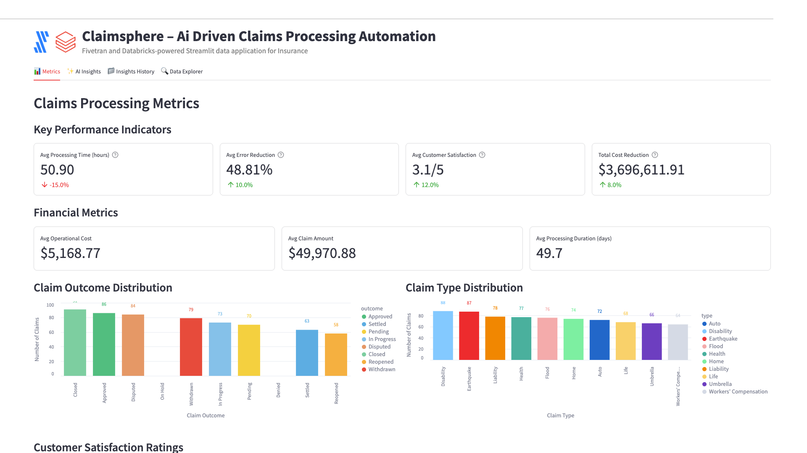

# ClaimSphere – AI-driven Claims Processing Automation



A Fivetran and Databricks-powered Streamlit data application for Insurance with advanced AI Agent Workflows.

## Overview

ClaimSphere is an AI-driven claims processing automation system that helps insurance companies transform manual claims handling into a streamlined, efficient process. This Streamlit on Databricks data application helps claims managers, underwriters, and customer service representatives reduce processing time, minimize errors, and improve customer satisfaction through real-time analysis of claims data.

The application features sophisticated AI Agent Workflows that provide transparent, step-by-step analysis of insurance claims data, transforming complex claims processing insights into actionable operational strategies and customer service improvements. Each analysis focus area operates through specialized mini-agents that simulate the decision-making process of experienced claims adjusters and insurance operations professionals.

The application utilizes a synthetic insurance dataset that simulates data from major claims management systems, policy administration systems, and CRM platforms. This synthetic data is moved into Databricks using a custom connector built with the Fivetran Connector SDK, enabling reliable and efficient data pipelines for insurance analytics.

## AI Agent Workflows

### Agent Architecture Overview

ClaimSphere employs a sophisticated multi-agent architecture designed specifically for insurance claims processing analysis. Each focus area operates through specialized AI agents that break down complex claims management tasks into transparent, sequential steps that mirror the thought processes of experienced claims professionals and insurance operations specialists.

### Focus Area Agents

#### Overall Performance Agent
**Business Challenge**: Claims managers manually review thousands of insurance claims daily, spending 3+ hours analyzing claim documents, validating information, and routing claims through complex approval workflows to ensure accurate settlements.

**Agent Solution**: Autonomous claims processing workflow that analyzes claim documents, validates policy information, and routes claims automatically with AI-driven classification, fraud detection, and settlement recommendations to accelerate processing and improve accuracy.

**Agent Workflow Steps**:
1. **Claims Processing Data Initialization** - Loading comprehensive insurance claims dataset with enhanced validation across claims and claim types
2. **Claims Processing Performance Assessment** - Advanced calculation of claims processing indicators with settlement analysis
3. **Insurance Pattern Recognition** - Sophisticated identification of claim outcome patterns with settlement correlation analysis
4. **AI Claims Intelligence Processing** - Processing comprehensive insurance data through selected AI model with advanced reasoning
5. **Insurance Claims Report Compilation** - Professional claims processing analysis with evidence-based recommendations and actionable settlement insights

#### Optimization Opportunities Agent
**Business Challenge**: Claims processing teams spend 4+ hours daily manually identifying inefficiencies in claim routing, validation workflows, and settlement processes across diverse insurance product lines and customer segments.

**Agent Solution**: AI-powered claims optimization analysis that automatically detects processing bottlenecks, validation gaps, and routing inefficiencies with specific implementation recommendations for Guidewire, Duck Creek, and Insurity system integration.

**Agent Workflow Steps**:
1. **Claims Optimization Data Preparation** - Advanced loading of insurance claims processing data with enhanced validation for efficiency improvement identification
2. **Claims Processing Inefficiency Detection** - Sophisticated analysis of claim routing and validation workflows with evidence-based inefficiency identification
3. **Insurance Correlation Analysis** - Enhanced examination of relationships between processing times, error rates, and customer satisfaction across insurance operations
4. **Claims System Integration Optimization** - Comprehensive evaluation of claims processing integration with existing Guidewire, Duck Creek, and Insurity management systems
5. **AI Claims Optimization Intelligence** - Generating advanced claims processing recommendations using selected AI model with insurance reasoning
6. **Claims Strategy Finalization** - Professional claims optimization report with prioritized implementation roadmap and processing efficiency impact analysis

#### Financial Impact Agent
**Business Challenge**: Insurance financial analysts manually calculate complex ROI metrics across claims operations and customer satisfaction, requiring 3+ hours of cost modeling to assess operational efficiency and claims settlement optimization.

**Agent Solution**: Automated insurance financial analysis that calculates comprehensive ROI, identifies operational cost reduction opportunities across claim types, and projects customer satisfaction benefits with detailed claims economics forecasting.

**Agent Workflow Steps**:
1. **Insurance Financial Data Integration** - Advanced loading of claims financial data and insurance operational metrics with enhanced validation across claims
2. **Claims Financial Impact Calculation** - Sophisticated ROI metrics calculation with settlement cost analysis and operational efficiency enhancement
3. **Customer Satisfaction Financial Assessment** - Enhanced analysis of insurance revenue impact with customer retention metrics and claims satisfaction correlation analysis
4. **Claims Portfolio Efficiency Analysis** - Comprehensive evaluation of resource allocation efficiency across claim types with settlement cost optimization
5. **AI Insurance Financial Modeling** - Advanced claims financial projections and operational ROI calculations using selected AI model
6. **Insurance Economics Report Generation** - Professional insurance financial impact analysis with detailed claims processing ROI calculations and operational cost forecasting

#### Strategic Recommendations Agent
**Business Challenge**: Chief Operating Officers spend hours manually analyzing competitive positioning and developing strategic roadmaps for claims processing automation advancement and digital transformation initiatives.

**Agent Solution**: Strategic insurance intelligence workflow that analyzes competitive advantages against traditional manual claims processing, identifies AI and automation integration opportunities, and creates prioritized digital claims transformation roadmaps.

**Agent Workflow Steps**:
1. **Insurance Technology Assessment** - Advanced loading of claims processing digital context with competitive positioning analysis across claims and insurance products
2. **Claims Processing Competitive Advantage Analysis** - Sophisticated evaluation of competitive positioning against traditional manual claims processing with AI-powered automation effectiveness
3. **Advanced Claims Technology Integration** - Enhanced analysis of integration opportunities with fraud detection AI, customer interaction automation, and advanced analytics across claims data dimensions
4. **Digital Claims Strategy Development** - Comprehensive development of prioritized digital transformation roadmap with evidence-based claims automation adoption strategies
5. **AI Insurance Strategic Processing** - Advanced claims processing strategic recommendations using selected AI model with long-term competitive positioning
6. **Digital Insurance Report Generation** - Professional digital insurance transformation roadmap with competitive analysis and claims automation implementation plan ready for COO executive review

### Agent Execution Flow

1. **Agent Initialization** - User selects focus area and AI model, triggering specialized agent activation
2. **Data Context Loading** - Agent accesses claims processing data, customer satisfaction metrics, and operational cost indicators
3. **Step-by-Step Processing** - Agent executes sequential workflow steps with real-time progress visualization
4. **Insurance Intelligence Integration** - Selected Databricks serving endpoint processes insurance context with specialized prompting
5. **Results Compilation** - Agent generates comprehensive claims processing analysis with actionable operational recommendations
6. **Report Delivery** - Professional insurance report delivered with implementation roadmap and success metrics

## Data Sources

The application is designed to work with data from major insurance systems and platforms:

### Insurance Data Sources (Simulated)
- **Claims Management Systems**: 
  - Guidewire
  - Duck Creek
  - Insurity
- **Policy Administration Systems**: 
  - Oracle
  - SAP
  - Insurity
- **Customer Relationship Management (CRM)**: 
  - Salesforce
  - HubSpot
  - Zoho

For demonstration and development purposes, we've created a synthetic dataset that approximates these data sources and combined them into a single table exposed through an API server. This approach allows for realistic insurance analytics without using protected policyholder information.

## Key Features

- **AI Agent Workflows**: Transparent, step-by-step insurance claims processing analysis through specialized mini-agents for each focus area
- **Agent Progress Visualization**: Real-time display of agent processing steps with insurance context and completion tracking
- **Focus Area Specialization**: Dedicated agents for Overall Performance, Optimization Opportunities, Financial Impact, and Strategic Recommendations
- **Insurance Intelligence Integration**: Seamless integration with multiple Databricks serving endpoints for specialized insurance analysis
- **Automated claims data extraction and validation**: Leverages AI to extract and validate claims data from various sources
- **AI-driven claims classification and routing**: Automatically categorizes and routes claims to the appropriate processing teams
- **Predictive analytics for claims outcome forecasting**: Predicts claim outcomes based on historical data patterns
- **Integration with synthetic insurance data**: Simulates data from major claims management systems, policy administration systems, and CRM platforms
- **Comprehensive data application**: Visual representation of key metrics including processing times, error reduction, and customer satisfaction
- **Custom Fivetran connector**: Utilizes a custom connector built with the Fivetran Connector SDK to reliably move data from the API server to Databricks

## Streamlit Data App Sections

### Metrics
- **Key Performance Indicators**: Track processing times, error reduction rates, customer satisfaction ratings, and cost reduction
- **Financial Metrics**: Monitor operational costs, claim amounts, and processing durations
- **Claim Outcome Distribution**: Visualize the distribution of claim outcomes (approved, settled, pending, etc.)
- **Claim Type Distribution**: Analyze the breakdown of claim types
- **Customer Satisfaction Ratings**: Review customer satisfaction metrics on a 1-5 scale
- **Claims Processing Metrics**: Explore top claim categories, subcategories, and customer segments

### AI Insights with Agent Workflows
Generate AI-powered insights through transparent agent workflows with different focus areas:
- **Overall Performance**: Comprehensive analysis of the claims processing automation system through autonomous claims processing workflow
- **Optimization Opportunities**: Areas where claims processing can be improved via AI-powered claims optimization analysis
- **Financial Impact**: Cost-benefit analysis and ROI in insurance terms through automated insurance financial analysis
- **Strategic Recommendations**: Long-term strategic implications for improvement via strategic insurance intelligence workflow

Each focus area includes:
- **Business Challenge Description**: Detailed explanation of the specific insurance problem being addressed
- **Agent Solution Overview**: Description of how the AI agent workflow solves the challenge
- **Real-time Progress Tracking**: Step-by-step visualization of agent processing with insurance context
- **Agent Execution Controls**: Start/stop controls for managing agent workflow execution
- **Professional Insurance Reports**: Comprehensive analysis reports with implementation roadmaps

### Insights History
Access previously generated agent-driven insights for reference and comparison, including agent execution details and model selection.

### Data Explorer
Explore the underlying data with pagination controls.

## Setup Instructions

### Prerequisites

#### Required Accounts & Resources
- **Databricks Workspace** with:
  - SQL Warehouse
  - Model Serving Endpoints (Claude, Llama models)
  - Unity Catalog
  - Databricks Apps
- **Fivetran Account** with:
  - Databricks destination
  - Custom connector capability

#### Python Requirements
```
altair==5.5.0
databricks-sql-connector==4.0.0
pandas==2.2.3
requests==2.32.3
streamlit==1.42.0
```

### Implementation Steps

#### 1. Repository Setup
```
ICP-INSURANCE-CLAIMS/
├── app.py
├── app.yaml
├── requirements.txt
├── .gitignore
├── README.md
└── images/
```

#### 2. Data Pipeline Setup

##### Fivetran Configuration
1. Ensure the API server hosting the synthetic insurance data is operational
2. Configure the custom Fivetran connector (built with Fivetran Connector SDK) to connect to the API server
3. Start the Fivetran sync to move data into an `icp_records` table in your Databricks Unity Catalog
4. Verify data is being loaded correctly by checking the table in Databricks

##### Unity Catalog Setup
Set up the following structure in Unity Catalog:
- **Catalog**: `ts-catalog-demo`
- **Schema**: `icp_connector_dbx`
- **Table**: `icp_records`

#### 3. App Deployment

##### Option A: Local Development
```bash
python -m venv venv
source venv/bin/activate
pip install -r requirements.txt
streamlit run app.py
```

##### Option B: Databricks Apps Deployment via VS Code

**Sync the files**
Move to the folder with your source code:

```bash
cd icp-insurance-claims
```

Sync source files into Databricks:

```bash
databricks sync --watch . /Workspace/Users/kelly.kohlleffel@fivetran.com/icp-insurance-claims
```

**Deploy to Databricks Apps**

```bash
databricks apps deploy icp-insurance-claims --source-code-path /Workspace/Users/kelly.kohlleffel@fivetran.com/icp-insurance-claims
```

##### Option C: Databricks UI Deployment
1. Navigate to Workspace > Apps
2. Create new app
3. Upload app.py and configuration files
4. Configure resources
5. Deploy

## Data Flow

1. **Synthetic Data Creation**: A synthetic dataset approximating real insurance data sources has been created and exposed via an API server:
   - Claims Management Systems: Guidewire, Duck Creek, Insurity
   - Policy Administration Systems: Oracle, SAP, Insurity
   - Customer Relationship Management (CRM): Salesforce, HubSpot, Zoho

2. **Custom Data Integration**: A custom connector built with the Fivetran Connector SDK communicates with the API server to extract the synthetic insurance data

3. **Automated Data Movement**: Fivetran manages the orchestration and scheduling of data movement from the API server into Databricks

4. **Data Loading**: The synthetic insurance data is loaded into Databricks Unity Catalog as an `icp_records` table in a structured format ready for analysis

5. **Agent Workflow Execution**: AI agents process the insurance claims data through specialized workflows, providing transparent step-by-step analysis

6. **Data Analysis**: Databricks SQL and serving endpoints analyze the data to generate insights through agent-driven processes

7. **Data Visualization**: Streamlit on Databricks presents the analyzed data in an interactive data application with agent workflow visualization

## Data Requirements

The application expects a table named `icp_records` in Unity Catalog which contains synthetic data simulating various insurance systems. This data is retrieved from an API server using a custom Fivetran connector built with the Fivetran Connector SDK:

### Policy and Claim Data
- `policy_id`
- `claim_id`
- `claim_date`
- `claim_status`
- `claim_type`
- `claim_outcome`
- `claim_category`
- `claim_subcategory`
- `policy_effective_date`
- `claim_amount`

### Customer Data
- `customer_id`
- `customer_name`
- `customer_segment`

### Processing Metrics
- `claim_processing_time`
- `claim_processing_duration`
- `claim_processing_start_date`
- `claim_processing_end_date`
- `claim_processing_error_reduction`

### Performance Metrics
- `customer_satisfaction_rating`
- `operational_cost`
- `operational_cost_reduction`

## Environment Configuration

### Required Environment Variables

```yaml
# Databricks Connection
DATABRICKS_HOST: https://your-workspace.databricks.com
DATABRICKS_SQL_HTTP_PATH: /sql/1.0/warehouses/ts-databricks-azure-sql-serverless-demo
DATABRICKS_TOKEN: your-databricks-token

# Unity Catalog Configuration
UC_CATALOG: ts-catalog-demo
UC_SCHEMA: icp_connector_dbx
UC_TABLE: icp_records

# Serving Endpoints
DBX_ENDPOINT: databricks-claude-sonnet-4
DBX_ENDPOINT_2: databricks-claude-opus-4
DBX_ENDPOINT_3: databricks-claude-3-7-sonnet
DBX_ENDPOINT_4: databricks-meta-llama-3-1-8b-instruct
DBX_ENDPOINT_5: databricks-meta-llama-3-3-70b-instruct
DBX_ENDPOINT_6: databricks-gemma-3-12b
DBX_ENDPOINT_7: databricks-llama-4-maverick

# Serving Endpoint URLs
DATABRICKS_SERVING_ENDPOINT_URL: https://your-workspace.databricks.com/serving-endpoints/databricks-claude-sonnet-4/invocations
DATABRICKS_ENDPOINT_2_URL: https://your-workspace.databricks.com/serving-endpoints/databricks-claude-opus-4/invocations
DATABRICKS_ENDPOINT_3_URL: https://your-workspace.databricks.com/serving-endpoints/databricks-claude-3-7-sonnet/invocations
DATABRICKS_ENDPOINT_4_URL: https://your-workspace.databricks.com/serving-endpoints/databricks-meta-llama-3-1-8b-instruct/invocations
DATABRICKS_ENDPOINT_5_URL: https://your-workspace.databricks.com/serving-endpoints/databricks-meta-llama-3-3-70b-instruct/invocations
DATABRICKS_ENDPOINT_6_URL: https://your-workspace.databricks.com/serving-endpoints/databricks-gemma-3-12b/invocations
DATABRICKS_ENDPOINT_7_URL: https://your-workspace.databricks.com/serving-endpoints/databricks-llama-4-maverick/invocations
```

## Benefits

- 15% reduction in claims processing time: 15,000 hours saved/year
- 10% reduction in claims processing errors: 500 fewer errors/year
- 12% increase in customer satisfaction ratings: 960 additional satisfied customers/year
- 8% reduction in operational costs: $800,000 savings/year
- **Enhanced Claims Transparency**: Agent workflows provide clear visibility into claims processing analysis reasoning and decision-making processes
- **Accelerated Claims Insights**: Automated agent processing reduces manual analysis time from hours to minutes for complex claims assessments

## Technical Details

This application uses:
- **AI Agent Workflow Engine**: Custom agent orchestration system for transparent, step-by-step claims processing analysis
- **Multi-Agent Architecture**: Specialized agents for different insurance focus areas with domain-specific processing
- **Agent Progress Visualization**: Real-time display of agent execution steps with insurance context and completion tracking
- **Streamlit on Databricks** for the user interface with enhanced agent workflow displays
- **Databricks Serving Endpoints** for AI-powered insights generation through agent-managed prompting
- **Multiple AI models** including Claude 4 Sonnet, Claude 4 Opus, Claude 3.7 Sonnet, Llama 3.1/3.3, Gemma, and Llama 4 Maverick for agent intelligence
- **Databricks SQL** for data processing within agent workflows
- **Fivetran Connector SDK** for building a custom connector to retrieve synthetic insurance data from an API server
- **Custom Fivetran connector** for automated, reliable data movement into Databricks Unity Catalog

## Troubleshooting Tips

### Common Issues
1. **Connection Errors**:
   - Verify SQL warehouse is running
   - Check Databricks token permissions
   - Confirm Unity Catalog access

2. **Serving Endpoint Issues**:
   - Verify all endpoint URLs in environment variables
   - Check endpoint status in Databricks
   - Review timeout settings

3. **Data Loading Issues**:
   - Confirm Unity Catalog table structure
   - Check Fivetran sync status
   - Verify `_fivetran_deleted = false` filter

4. **Agent Workflow Issues**:
   - Check serving endpoint connectivity
   - Review agent progress logs
   - Verify model selection and availability

## Success Metrics

- Claims processing time reduction
- Claims processing accuracy improvement
- Customer satisfaction rating increase
- Operational cost savings
- **Agent Workflow Efficiency**: Time reduction from manual claims analysis to automated agent-driven insights
- **Claims Processing Transparency Score**: User confidence in insurance recommendations through visible agent reasoning
- **Insurance Analysis Accuracy**: Improvement in claims processing decision quality through systematic agent processing

## Key Stakeholders

- Claims managers
- Underwriters
- Customer service representatives
- Chief Operating Officer (COO)
- **Insurance Data Analysts**: Professionals who benefit from transparent agent workflow visibility
- **Claims Processing Teams**: Staff who implement agent-recommended claims processing strategies

## Competitive Advantage

ClaimSphere differentiates itself from traditional approaches by leveraging generative AI with transparent agent workflows to automate claims processing, reducing manual errors, and improving claims settlement speed. The agent-based architecture provides unprecedented visibility into claims processing analysis reasoning, building trust and confidence in AI-driven insurance decisions. This creates a competitive advantage by delivering faster, more accurate claims processing while maintaining complete transparency in the decision-making process.

## Long-term Evolution

In the next 3-5 years, ClaimSphere will evolve to incorporate more advanced generative AI techniques and sophisticated agent architectures, including:

- **Multi-modal Agent Learning**: Agents that can process claim documents, photos, and video evidence from diverse insurance channels
- **Collaborative Agent Networks**: Multiple agents working together to solve complex claims processing challenges across different insurance product lines
- **Adaptive Agent Intelligence**: Self-improving agents that learn from claims outcomes and refine their analytical approaches
- **Advanced Agent Orchestration**: Sophisticated workflow management for complex, multi-step claims processing analysis
- **Integration with Emerging Insurance Technologies**: Agent connectivity with fraud detection systems, telemedicine platforms, and IoT monitoring for comprehensive claims processing automation

The system will expand to include integration with new data sources, improved AI models, and expansion to other insurance products and lines of business, all orchestrated through advanced agent workflows that provide complete transparency and control over the claims processing analysis process.