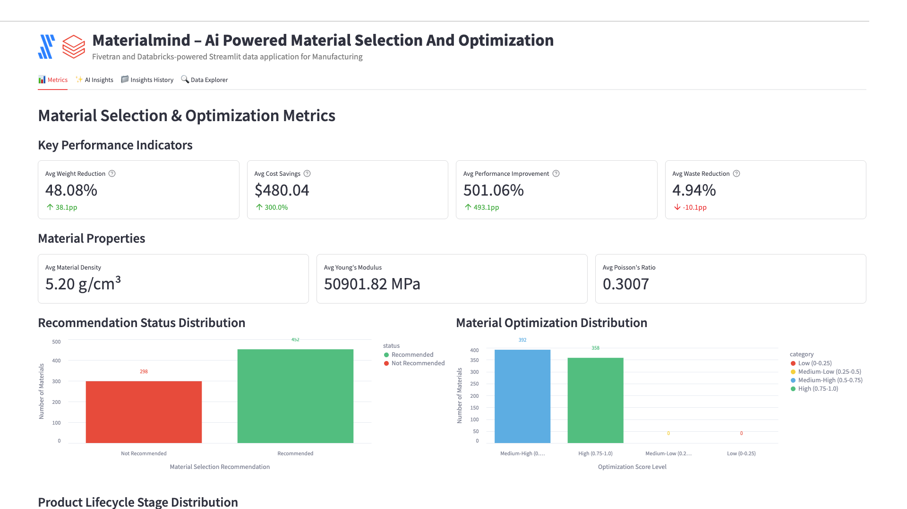

# MaterialMind – AI-powered Material Selection and Optimization



A Fivetran and Databricks-powered Streamlit data application for Manufacturing with advanced AI Agent Workflows.

## Overview

MaterialMind is an AI-driven material selection and optimization system that helps manufacturers make better material choices for their products. This Streamlit on Databricks data application helps product designers, materials engineers, and operations directors reduce material costs, decrease product weight, increase product performance, and reduce material waste through real-time analysis of material properties.

The application features sophisticated AI Agent Workflows that provide transparent, step-by-step analysis of manufacturing material data, transforming complex material property insights into actionable product development and optimization strategies. Each analysis focus area operates through specialized mini-agents that simulate the decision-making process of experienced materials engineers and manufacturing optimization specialists.

The application utilizes a synthetic manufacturing dataset that simulates data from material properties databases, product lifecycle management systems, and CAD systems. This synthetic data is moved into Databricks using a custom connector built with the Fivetran Connector SDK, enabling reliable and efficient data pipelines for manufacturing analytics.

## AI Agent Workflows

### Agent Architecture Overview

MaterialMind employs a sophisticated multi-agent architecture designed specifically for manufacturing material selection analysis. Each focus area operates through specialized AI agents that break down complex material optimization tasks into transparent, sequential steps that mirror the thought processes of experienced materials engineers and product development professionals.

### Focus Area Agents

#### Overall Performance Agent
**Business Challenge**: Product designers and materials engineers manually review hundreds of material properties and performance specifications daily, spending 4+ hours analyzing density, Young's modulus, and cost data to optimize material selection for weight reduction and performance improvement.

**Agent Solution**: Autonomous material optimization workflow that analyzes material properties databases, CAD system integration data, and performance metrics to generate AI-driven material recommendations with cost savings, weight reduction, and performance improvement predictions.

**Agent Workflow Steps**:
1. **Material Properties Data Initialization** - Loading comprehensive material properties dataset with enhanced validation across materials and product lifecycle stages
2. **Material Optimization Performance Assessment** - Advanced calculation of material selection indicators with weight and cost analysis
3. **Manufacturing Pattern Recognition** - Sophisticated identification of material performance patterns with CAD system correlation analysis
4. **AI Material Intelligence Processing** - Processing comprehensive manufacturing data through selected AI model with advanced reasoning
5. **Manufacturing Optimization Report Compilation** - Professional material selection analysis with evidence-based recommendations and actionable optimization insights

#### Optimization Opportunities Agent
**Business Challenge**: Materials engineers spend 3+ hours daily manually identifying inefficiencies in material selection processes, waste reduction opportunities, and CAD system integration gaps across diverse manufacturing product lines.

**Agent Solution**: AI-powered material optimization analysis that automatically detects material selection inefficiencies, waste reduction opportunities, and CAD integration improvements with specific implementation recommendations for Autodesk Inventor, SolidWorks, and Siemens NX systems.

**Agent Workflow Steps**:
1. **Material Optimization Data Preparation** - Advanced loading of manufacturing material selection data with enhanced validation for efficiency improvement identification
2. **Material Selection Inefficiency Detection** - Sophisticated analysis of material properties and CAD integration workflows with evidence-based inefficiency identification
3. **Manufacturing Correlation Analysis** - Enhanced examination of relationships between material properties, designer experience, and optimization outcomes
4. **CAD System Integration Optimization** - Comprehensive evaluation of material selection integration with existing Autodesk Inventor, SolidWorks, and Siemens NX CAD platforms
5. **AI Manufacturing Optimization Intelligence** - Generating advanced material selection recommendations using selected AI model with manufacturing reasoning
6. **Material Strategy Finalization** - Professional material optimization report with prioritized implementation roadmap and manufacturing efficiency impact analysis

#### Financial Impact Agent
**Business Challenge**: Manufacturing financial analysts manually calculate complex ROI metrics across material costs and product performance improvements, requiring 3+ hours of cost modeling to assess material optimization impact on production efficiency.

**Agent Solution**: Automated manufacturing financial analysis that calculates comprehensive ROI, identifies material cost reduction opportunities across product lifecycle stages, and projects performance improvement benefits with detailed manufacturing economics forecasting.

**Agent Workflow Steps**:
1. **Manufacturing Financial Data Integration** - Advanced loading of material cost data and manufacturing financial metrics with enhanced validation across materials
2. **Material Cost-Benefit Calculation** - Sophisticated ROI metrics calculation with weight reduction analysis and manufacturing efficiency enhancement
3. **Product Performance Financial Assessment** - Enhanced analysis of manufacturing revenue impact with performance improvement metrics and material cost correlation analysis
4. **Manufacturing Portfolio Efficiency Analysis** - Comprehensive evaluation of resource allocation efficiency across material types with lifecycle cost optimization
5. **AI Manufacturing Financial Modeling** - Advanced material cost projections and manufacturing ROI calculations using selected AI model
6. **Manufacturing Economics Report Generation** - Professional manufacturing financial impact analysis with detailed material optimization ROI calculations and cost forecasting

#### Strategic Recommendations Agent
**Business Challenge**: Chief Operating Officers spend hours manually analyzing advanced manufacturing trends and developing strategic roadmaps for material science innovation and next-generation manufacturing technology integration.

**Agent Solution**: Strategic manufacturing intelligence workflow that analyzes competitive advantages against traditional material selection methods, identifies emerging materials integration opportunities with nanomaterials, and creates prioritized advanced manufacturing transformation roadmaps.

**Agent Workflow Steps**:
1. **Manufacturing Technology Assessment** - Advanced loading of advanced manufacturing context with competitive positioning analysis across materials and product lifecycle stages
2. **Material Science Competitive Advantage Analysis** - Sophisticated evaluation of competitive positioning against traditional material selection methods with AI-powered optimization effectiveness
3. **Advanced Materials Technology Integration** - Enhanced analysis of integration opportunities with nanomaterials, advanced composites, and emerging manufacturing technologies across material data dimensions
4. **Digital Manufacturing Strategy Development** - Comprehensive development of prioritized advanced manufacturing roadmap with evidence-based material science innovation adoption strategies
5. **AI Manufacturing Strategic Processing** - Advanced material science strategic recommendations using selected AI model with long-term competitive positioning
6. **Advanced Manufacturing Report Generation** - Professional advanced manufacturing transformation roadmap with competitive analysis and material science innovation plan ready for COO executive review

### Agent Execution Flow

1. **Agent Initialization** - User selects focus area and AI model, triggering specialized agent activation
2. **Data Context Loading** - Agent accesses material properties data, CAD integration metrics, and manufacturing performance indicators
3. **Step-by-Step Processing** - Agent executes sequential workflow steps with real-time progress visualization
4. **Manufacturing Intelligence Integration** - Selected Databricks serving endpoint processes manufacturing context with specialized prompting
5. **Results Compilation** - Agent generates comprehensive material optimization analysis with actionable manufacturing recommendations
6. **Report Delivery** - Professional manufacturing report delivered with implementation roadmap and success metrics

## Data Sources

The application is designed to work with data from major manufacturing systems and databases:

### Manufacturing Data Sources (Simulated)
- **Material Properties Databases**: 
  - MatWeb
  - Granta Design
  - Material Properties Database
- **Product Lifecycle Management (PLM) Systems**: 
  - Siemens Teamcenter
  - PTC Windchill
  - Oracle Agile
- **Computer-Aided Design (CAD) Systems**: 
  - Autodesk Inventor
  - SolidWorks
  - Siemens NX

For demonstration and development purposes, we've created a synthetic dataset that approximates these data sources and combined them into a single table exposed through an API server. This approach allows for realistic manufacturing analytics without using proprietary material data.

## Key Features

- **AI Agent Workflows**: Transparent, step-by-step manufacturing material selection analysis through specialized mini-agents for each focus area
- **Agent Progress Visualization**: Real-time display of agent processing steps with manufacturing context and completion tracking
- **Focus Area Specialization**: Dedicated agents for Overall Performance, Optimization Opportunities, Financial Impact, and Strategic Recommendations
- **Manufacturing Intelligence Integration**: Seamless integration with multiple Databricks serving endpoints for specialized manufacturing analysis
- **AI-driven material selection and optimization**: Leverages generative AI to analyze material properties and recommend optimal materials for specific product requirements
- **Integration with synthetic manufacturing data**: Simulates data from major material databases, PLM systems, and CAD platforms
- **Comprehensive data application**: Visual representation of key metrics including weight reduction, cost savings, performance improvement, and waste reduction
- **Custom Fivetran connector**: Utilizes a custom connector built with the Fivetran Connector SDK to reliably move data from the API server to Databricks

## Streamlit Data App Sections

### Metrics
- **Key Performance Indicators**: Track weight reduction, cost savings, performance improvement, and waste reduction
- **Material Properties**: Monitor density, Young's modulus, and Poisson's ratio
- **Recommendation Status Distribution**: Visualize the distribution of material selection recommendations
- **Material Optimization Distribution**: See the breakdown of optimization scores
- **Product Lifecycle Stage Distribution**: Analyze product distribution across lifecycle stages
- **Designer Metrics**: Review designer skill levels and CAD system usage
- **Cost Savings vs Weight Reduction Quadrant Analysis**: Map materials by cost savings and weight reduction performance

### AI Insights with Agent Workflows
Generate AI-powered insights through transparent agent workflows with different focus areas:
- **Overall Performance**: Comprehensive analysis of the material selection and optimization system through autonomous material optimization workflow
- **Optimization Opportunities**: Areas where material selection can be improved via AI-powered material optimization analysis
- **Financial Impact**: Cost-benefit analysis and ROI in manufacturing terms through automated manufacturing financial analysis
- **Strategic Recommendations**: Long-term strategic implications for improvement via strategic manufacturing intelligence workflow

Each focus area includes:
- **Business Challenge Description**: Detailed explanation of the specific manufacturing problem being addressed
- **Agent Solution Overview**: Description of how the AI agent workflow solves the challenge
- **Real-time Progress Tracking**: Step-by-step visualization of agent processing with manufacturing context
- **Agent Execution Controls**: Start/stop controls for managing agent workflow execution
- **Professional Manufacturing Reports**: Comprehensive analysis reports with implementation roadmaps

### Insights History
Access previously generated agent-driven insights for reference and comparison, including agent execution details and model selection.

### Data Explorer
Explore the underlying data with pagination controls.

## Setup Instructions

### Prerequisites

#### Required Accounts & Resources
- **Databricks Workspace** with:
  - SQL Warehouse (`ts-databricks-azure-sql-serverless-demo`)
  - Model Serving Endpoints (Claude, Llama models)
  - Unity Catalog
  - Databricks Apps
- **Fivetran Account** with:
  - Databricks destination
  - Custom connector capability

#### Python Requirements
```
altair==5.5.0
databricks-sql-connector==4.0.0
pandas==2.2.3
requests==2.32.3
streamlit==1.42.0
```

### Implementation Steps

#### 1. Repository Setup
```
MSO-MANUF-MATLSELECT/
├── app.py
├── app.yaml
├── requirements.txt
├── .gitignore
├── README.md
└── images/
```

#### 2. Data Pipeline Setup

##### Fivetran Configuration
1. Ensure the API server hosting the synthetic manufacturing data is operational
2. Configure the custom Fivetran connector (built with Fivetran Connector SDK) to connect to the API server
3. Start the Fivetran sync to move data into a `mso_records` table in your Databricks Unity Catalog
4. Verify data is being loaded correctly by checking the table in Databricks

##### Unity Catalog Setup
Set up the following structure in Unity Catalog:
- **Catalog**: `ts-catalog-demo`
- **Schema**: `mso_connector_dbx`
- **Table**: `mso_records`

#### 3. App Deployment

##### Option A: Local Development
```bash
python -m venv venv
source venv/bin/activate
pip install -r requirements.txt
streamlit run app.py
```

##### Option B: Databricks Apps Deployment via VS Code

**Sync the files**
Move to the folder with your source code:

```bash
cd mso-manuf-matlselect
```

Sync source files into Databricks:

```bash
databricks sync --watch . /Workspace/Users/kelly.kohlleffel@fivetran.com/mso-manuf-matlselect
```

**Deploy to Databricks Apps**

```bash
databricks apps deploy mso-manuf-matlselect --source-code-path /Workspace/Users/kelly.kohlleffel@fivetran.com/mso-manuf-matlselect
```

##### Option C: Databricks UI Deployment
1. Navigate to Workspace > Apps
2. Create new app
3. Upload app.py and configuration files
4. Configure resources
5. Deploy

## Data Flow

1. **Synthetic Data Creation**: A synthetic dataset approximating real manufacturing data sources has been created and exposed via an API server:
   - Material Properties Databases: MatWeb, Granta Design, Material Properties Database
   - Product Lifecycle Management Systems: Siemens Teamcenter, PTC Windchill, Oracle Agile
   - Computer-Aided Design Systems: Autodesk Inventor, SolidWorks, Siemens NX

2. **Custom Data Integration**: A custom connector built with the Fivetran Connector SDK communicates with the API server to extract the synthetic manufacturing data

3. **Automated Data Movement**: Fivetran manages the orchestration and scheduling of data movement from the API server into Databricks

4. **Data Loading**: The synthetic manufacturing data is loaded into Databricks Unity Catalog as a `mso_records` table in a structured format ready for analysis

5. **Agent Workflow Execution**: AI agents process the material selection data through specialized workflows, providing transparent step-by-step analysis

6. **Data Analysis**: Databricks SQL and serving endpoints analyze the data to generate insights through agent-driven processes

7. **Data Visualization**: Streamlit on Databricks presents the analyzed data in an interactive data application with agent workflow visualization

## Data Requirements

The application expects a table named `mso_records` in Unity Catalog which contains synthetic data simulating various manufacturing systems. This data is retrieved from an API server using a custom Fivetran connector built with the Fivetran Connector SDK:

### Material Data
- `material_id`
- `material_name`
- `density`
- `youngs_modulus`
- `poissons_ratio`
- `material_cost`
- `material_weight`
- `material_waste`
- `material_selection_score`
- `material_optimization_score`
- `material_selection_recommendation`
- `material_optimization_recommendation`
- `material_selection_date`
- `material_optimization_date`

### Product Data
- `product_id`
- `product_name`
- `product_description`
- `product_performance`
- `product_lifecycle_stage`
- `product_lifecycle_status`

### Designer Data
- `designer_id`
- `designer_name`
- `designer_experience`
- `designer_skill_level`
- `cad_system`
- `cad_file_name`

### Performance Metrics
- `cost_savings`
- `weight_reduction`
- `performance_improvement`
- `waste_reduction`

## Environment Configuration

### Required Environment Variables

```yaml
# Databricks Connection
DATABRICKS_HOST: https://your-workspace.databricks.com
DATABRICKS_SQL_HTTP_PATH: /sql/1.0/warehouses/your-warehouse-id
DATABRICKS_TOKEN: your-databricks-token

# Unity Catalog Configuration
UC_CATALOG: ts-catalog-demo
UC_SCHEMA: mso_connector_dbx
UC_TABLE: mso_records

# Serving Endpoints
DBX_ENDPOINT: databricks-claude-sonnet-4
DBX_ENDPOINT_2: databricks-claude-opus-4
DBX_ENDPOINT_3: databricks-claude-3-7-sonnet
DBX_ENDPOINT_4: databricks-meta-llama-3-1-8b-instruct
DBX_ENDPOINT_5: databricks-meta-llama-3-3-70b-instruct
DBX_ENDPOINT_6: databricks-gemma-3-12b
DBX_ENDPOINT_7: databricks-llama-4-maverick

# Serving Endpoint URLs
DATABRICKS_SERVING_ENDPOINT_URL: https://your-workspace.databricks.com/serving-endpoints/databricks-claude-sonnet-4/invocations
DATABRICKS_ENDPOINT_2_URL: https://your-workspace.databricks.com/serving-endpoints/databricks-claude-opus-4/invocations
DATABRICKS_ENDPOINT_3_URL: https://your-workspace.databricks.com/serving-endpoints/databricks-claude-3-7-sonnet/invocations
DATABRICKS_ENDPOINT_4_URL: https://your-workspace.databricks.com/serving-endpoints/databricks-meta-llama-3-1-8b-instruct/invocations
DATABRICKS_ENDPOINT_5_URL: https://your-workspace.databricks.com/serving-endpoints/databricks-meta-llama-3-3-70b-instruct/invocations
DATABRICKS_ENDPOINT_6_URL: https://your-workspace.databricks.com/serving-endpoints/databricks-gemma-3-12b/invocations
DATABRICKS_ENDPOINT_7_URL: https://your-workspace.databricks.com/serving-endpoints/databricks-llama-4-maverick/invocations
```

## App Resources Configuration

The following resources are configured in your Databricks environment and referenced in the app.py:

| Key | Type | Details |
|-----|------|---------|
| sql_warehouse | SQL Warehouse | ts-databricks-azure-sql-serverless-demo |
| secret | Secret | Key: databricks-token-secret |
| serving_endpoint | Serving Endpoint | databricks-claude-sonnet-4 |
| serving_endpoint-2 | Serving Endpoint | databricks-claude-opus-4 |
| serving_endpoint-3 | Serving Endpoint | databricks-claude-3-7-sonnet |
| serving_endpoint-4 | Serving Endpoint | databricks-meta-llama-3-1-8b-instruct |
| serving_endpoint-5 | Serving Endpoint | databricks-meta-llama-3-3-70b-instruct |
| serving_endpoint-6 | Serving Endpoint | databricks-gemma-3-12b |
| serving_endpoint-7 | Serving Endpoint | databricks-llama-4-maverick |

## Benefits

- 12% reduction in material costs: $120,000 savings/year
- 10% decrease in product weight: 10 kg/unit saved
- 8% increase in product performance: 8 additional units/year
- 15% reduction in material waste: 1,500 kg saved/year
- **Enhanced Manufacturing Transparency**: Agent workflows provide clear visibility into material selection analysis reasoning and decision-making processes
- **Accelerated Design Insights**: Automated agent processing reduces manual analysis time from hours to minutes for complex material optimization assessments

## Technical Details

This application uses:
- **AI Agent Workflow Engine**: Custom agent orchestration system for transparent, step-by-step material selection analysis
- **Multi-Agent Architecture**: Specialized agents for different manufacturing focus areas with domain-specific processing
- **Agent Progress Visualization**: Real-time display of agent execution steps with manufacturing context and completion tracking
- **Streamlit on Databricks** for the user interface with enhanced agent workflow displays
- **Databricks Serving Endpoints** for AI-powered insights generation through agent-managed prompting
- **Multiple AI models** including Claude 4 Sonnet, Claude 4 Opus, Claude 3.7 Sonnet, Llama 3.1/3.3, Gemma, and Llama 4 Maverick for agent intelligence
- **Databricks SQL** for data processing within agent workflows
- **Fivetran Connector SDK** for building a custom connector to retrieve synthetic manufacturing data from an API server
- **Custom Fivetran connector** for automated, reliable data movement into Databricks Unity Catalog

## Troubleshooting Tips

### Common Issues
1. **Connection Errors**:
   - Verify SQL warehouse is running (`ts-databricks-azure-sql-serverless-demo`)
   - Check Databricks token permissions
   - Confirm Unity Catalog access to `ts-catalog-demo.mso_connector_dbx.mso_records`

2. **Serving Endpoint Issues**:
   - Verify all endpoint URLs in environment variables
   - Check endpoint status in Databricks (claude-sonnet-4, claude-opus-4, etc.)
   - Review timeout settings

3. **Data Loading Issues**:
   - Confirm Unity Catalog table structure matches expected schema
   - Check Fivetran sync status for `mso_records` table
   - Verify `_fivetran_deleted = false` filter is working

4. **Agent Workflow Issues**:
   - Check serving endpoint connectivity for all 7 endpoints
   - Review agent progress logs for specific failure points
   - Verify model selection and availability

## Success Metrics

- Material cost savings
- Product weight reduction
- Product performance improvement
- Material waste reduction
- **Agent Workflow Efficiency**: Time reduction from manual material analysis to automated agent-driven insights
- **Material Selection Transparency Score**: User confidence in manufacturing recommendations through visible agent reasoning
- **Manufacturing Analysis Accuracy**: Improvement in material selection decision quality through systematic agent processing

## Key Stakeholders

- Product Designers
- Materials Engineers
- Operations Directors
- Chief Operating Officer (COO)
- **Manufacturing Data Analysts**: Professionals who benefit from transparent agent workflow visibility
- **Product Development Teams**: Staff who implement agent-recommended material optimization strategies

## Competitive Advantage

MaterialMind optimizes material selection for improved product performance and reduced costs through transparent agent workflows that provide unprecedented visibility into material optimization analysis reasoning. The agent-based architecture builds trust and confidence in AI-driven manufacturing decisions by delivering optimal material recommendations while maintaining complete transparency in the decision-making process. This creates a competitive advantage by enabling faster, more accurate material selection compared to traditional methods.

## Long-term Evolution

In the next 3-5 years, MaterialMind will evolve to incorporate more advanced generative AI techniques and sophisticated agent architectures, including:

- **Multi-modal Agent Learning**: Agents that can process material test data, CAD models, and performance documentation from diverse manufacturing systems
- **Collaborative Agent Networks**: Multiple agents working together to solve complex material optimization challenges across different product categories
- **Adaptive Agent Intelligence**: Self-improving agents that learn from manufacturing outcomes and refine their analytical approaches
- **Advanced Agent Orchestration**: Sophisticated workflow management for complex, multi-step material selection analysis processes
- **Integration with Emerging Manufacturing Technologies**: Agent connectivity with nanomaterials databases, advanced composite systems, and smart manufacturing platforms for comprehensive material optimization

The system will expand to include integration with emerging technologies such as nanomaterials for enhanced material selection and optimization, and expansion to other product development stages including prototyping and testing, all orchestrated through advanced agent workflows that provide complete transparency and control over the material selection analysis process.