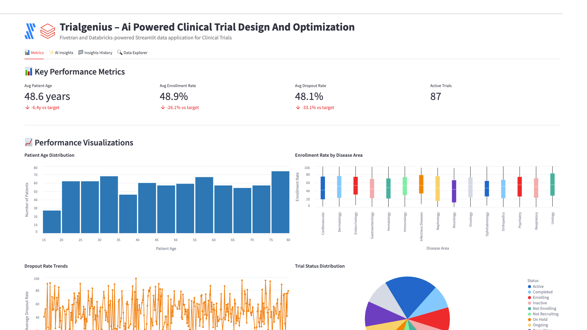

# TrialGenius – AI-Powered Clinical Trial Design and Optimization



A Fivetran and Databricks-powered Streamlit data application for Pharmaceutical Clinical Trials with advanced AI Agent Workflows.

## Overview

TrialGenius is an AI-powered clinical trial design and optimization system that helps pharmaceutical companies automate the manual and time-consuming process of analyzing clinical trial protocols, patient enrollment data, and trial performance metrics. This Streamlit on Databricks data application helps Chief Medical Officers, Clinical Operations Directors, and VP of Clinical Development reduce trial failure rates, decrease development costs, minimize enrollment delays, and accelerate patient recruitment through real-time analysis of clinical trial data.

The application features sophisticated AI Agent Workflows that provide transparent, step-by-step analysis of clinical trial data, transforming complex protocol designs and patient recruitment strategies into actionable clinical insights and adaptive trial recommendations. Each analysis focus area operates through specialized mini-agents that simulate the decision-making process of experienced clinical operations professionals and trial design experts.

The application utilizes a synthetic pharmaceutical dataset that simulates data from clinical trial management systems (CTMS), electronic data capture (EDC) platforms, and real-world evidence databases. This synthetic data is moved into Databricks using a custom connector built with the Fivetran Connector SDK, enabling reliable and efficient data pipelines for pharmaceutical clinical trial analytics.

## AI Agent Workflows

### Agent Architecture Overview

TrialGenius employs a sophisticated multi-agent architecture designed specifically for pharmaceutical clinical trial analysis. Each focus area operates through specialized AI agents that break down complex trial design and patient recruitment tasks into transparent, sequential steps that mirror the thought processes of experienced clinical operations professionals and trial design experts.

### Focus Area Agents

#### Overall Performance Agent
**Business Challenge**: Chief Medical Officers manually review hundreds of clinical trial protocols, enrollment data, and patient outcomes daily, spending 4+ hours analyzing trial performance, patient stratification effectiveness, and site performance to identify critical enrollment issues and protocol optimization opportunities.

**Agent Solution**: Autonomous clinical trial workflow that analyzes protocol data, enrollment metrics, patient demographics, and site performance to generate automated trial summaries, identify enrollment bottlenecks, and produce prioritized clinical insights with adaptive trial design recommendations.

**Agent Workflow Steps**:
1. **Clinical Trial Data Initialization** - Loading comprehensive clinical trial dataset with enhanced validation across patient records and active trials
2. **Patient Enrollment Assessment** - Advanced calculation of clinical trial indicators with enrollment analysis
3. **Clinical Trial Pattern Recognition** - Sophisticated identification of patient recruitment patterns with site correlation analysis
4. **AI Clinical Trial Intelligence Processing** - Processing comprehensive clinical data through selected AI model with advanced reasoning
5. **Clinical Performance Report Compilation** - Professional clinical trial analysis with evidence-based recommendations and actionable protocol insights

#### Optimization Opportunities Agent
**Business Challenge**: Clinical Operations Directors spend 5+ hours daily manually identifying inefficiencies in patient recruitment strategies, site selection criteria, and protocol design parameters across multiple concurrent clinical trials and therapeutic areas.

**Agent Solution**: AI-powered clinical trial optimization analysis that automatically detects patient recruitment gaps, site performance inefficiencies, and protocol design improvements with specific implementation recommendations for CTMS and EDC system integration.

**Agent Workflow Steps**:
1. **Clinical Trial Optimization Data Preparation** - Advanced loading of patient recruitment data with enhanced validation for enrollment improvement identification
2. **Patient Recruitment Inefficiency Detection** - Sophisticated analysis of enrollment strategies and site performance with evidence-based inefficiency identification
3. **Clinical Trial Correlation Analysis** - Enhanced examination of relationships between disease areas, patient demographics, and enrollment success rates
4. **CTMS Integration Optimization** - Comprehensive evaluation of clinical operations integration with existing Veeva, Oracle, and Medidata CTMS systems
5. **AI Clinical Trial Intelligence** - Generating advanced clinical optimization recommendations using selected AI model with pharmaceutical reasoning
6. **Clinical Trial Strategy Finalization** - Professional clinical trial optimization report with prioritized implementation roadmap and enrollment impact analysis

#### Financial Impact Agent
**Business Challenge**: VP of Clinical Development manually calculate complex ROI metrics across clinical trial activities and patient recruitment performance, requiring 4+ hours of cost modeling to assess trial efficiency and development cost optimization across the clinical portfolio.

**Agent Solution**: Automated pharmaceutical financial analysis that calculates comprehensive clinical trial ROI, identifies patient recruitment cost reduction opportunities across disease areas, and projects trial efficiency benefits with detailed development cost forecasting.

**Agent Workflow Steps**:
1. **Pharmaceutical Financial Data Integration** - Advanced loading of clinical trial financial data and development cost metrics with enhanced validation across patient records
2. **Clinical Development Cost-Benefit Calculation** - Sophisticated ROI metrics calculation with patient recruitment analysis and clinical trial efficiency cost savings
3. **Patient Recruitment Impact Assessment** - Enhanced analysis of clinical trial revenue impact with patient retention metrics and enrollment cost correlation analysis
4. **Clinical Trial Resource Efficiency Analysis** - Comprehensive evaluation of resource allocation efficiency across patient recruitment activities with trial lifecycle cost optimization
5. **AI Pharmaceutical Financial Modeling** - Advanced clinical trial financial projections and development ROI calculations using selected AI model
6. **Clinical Trial Economics Report Generation** - Professional pharmaceutical financial impact analysis with detailed clinical development ROI calculations and trial cost forecasting

#### Strategic Recommendations Agent
**Business Challenge**: Chief Medical Officers spend hours manually analyzing digital transformation opportunities and developing strategic clinical technology roadmaps for trial design advancement and adaptive trial implementation across therapeutic portfolios.

**Agent Solution**: Strategic clinical trial intelligence workflow that analyzes competitive advantages against traditional manual trial design processes, identifies AI and adaptive trial integration opportunities, and creates prioritized digital clinical transformation roadmaps.

**Agent Workflow Steps**:
1. **Pharmaceutical Technology Assessment** - Advanced loading of clinical trial digital context with competitive positioning analysis across patient records and active trials
2. **Clinical Trial Competitive Advantage Analysis** - Sophisticated evaluation of competitive positioning against traditional manual trial design with AI-powered protocol optimization effectiveness
3. **Advanced Clinical Technology Integration** - Enhanced analysis of integration opportunities with digital biomarkers, adaptive trial designs, and AI-powered patient stratification across clinical data dimensions
4. **Digital Clinical Operations Strategy Development** - Comprehensive development of prioritized digital transformation roadmap with evidence-based clinical technology adoption strategies
5. **AI Pharmaceutical Strategic Processing** - Advanced clinical trial strategic recommendations using selected AI model with long-term competitive positioning
6. **Digital Clinical Trial Report Generation** - Professional digital pharmaceutical transformation roadmap with competitive analysis and clinical technology implementation plan ready for CMO executive review

### Agent Execution Flow

1. **Agent Initialization** - User selects focus area and AI model, triggering specialized agent activation
2. **Data Context Loading** - Agent accesses clinical trial protocols, patient enrollment records, and site performance metrics
3. **Step-by-Step Processing** - Agent executes sequential workflow steps with real-time progress visualization
4. **Clinical Trial Intelligence Integration** - Selected Databricks serving endpoint processes pharmaceutical context with specialized prompting
5. **Results Compilation** - Agent generates comprehensive clinical trial analysis with actionable protocol recommendations
6. **Report Delivery** - Professional pharmaceutical report delivered with implementation roadmap and success metrics

## Data Sources

The application is designed to work with data from major pharmaceutical clinical trial systems:

### Pharmaceutical Data Sources (Simulated)
- **Clinical Trial Management Systems (CTMS)**: 
  - Veeva Vault CTMS
  - Oracle Clinical One
  - Medidata Rave
- **Electronic Data Capture (EDC) Platforms**: 
  - Medidata Rave EDC
  - Oracle Clinical One Data Collection
  - Veeva Vault EDC
- **Real-World Evidence Databases**: 
  - Flatiron Health
  - IQVIA Real-World Data
  - Optum Clinformatics
- **Regulatory Databases**:
  - FDA Orange Book
  - EMA Clinical Data Publication Policy
  - ClinicalTrials.gov
- **Patient Registries**:
  - TriNetX
  - IBM Watson Health
  - Syapse
- **Genomic Databases**:
  - gnomAD
  - UK Biobank
  - All of Us Research Program

For demonstration and development purposes, we've created a synthetic dataset that approximates these data sources and combined them into a single table exposed through an API server. This approach allows for realistic pharmaceutical clinical trial analytics without using proprietary patient data.

## Key Features

- **AI Agent Workflows**: Transparent, step-by-step clinical trial analysis through specialized mini-agents for each focus area
- **Agent Progress Visualization**: Real-time display of agent processing steps with pharmaceutical context and completion tracking
- **Focus Area Specialization**: Dedicated agents for Overall Performance, Optimization Opportunities, Financial Impact, and Strategic Recommendations
- **Clinical Trial Intelligence Integration**: Seamless integration with multiple Databricks serving endpoints for specialized pharmaceutical analysis
- **AI-powered clinical trial design optimization**: Leverages generative AI to analyze clinical protocols and automatically generate optimized trial designs with key insights
- **Integration with synthetic pharmaceutical data**: Simulates data from major clinical trial systems, CTMS platforms, and EDC systems
- **Comprehensive data application**: Visual representation of key metrics including enrollment rates, dropout rates, patient demographics, and trial performance
- **Custom Fivetran connector**: Utilizes a custom connector built with the Fivetran Connector SDK to reliably move data from the API server to Databricks

## Streamlit Data App Sections

### Metrics
- **Key Performance Indicators**: Track patient age, enrollment rates, dropout rates, and active trials
- **Clinical Analytics**: Monitor disease areas, trial status, and patient recruitment efficiency
- **Patient Age Distribution**: Visualize patient demographics across clinical trials
- **Enrollment Rate Analysis**: Analyze enrollment rates by disease area with boxplot visualizations
- **Dropout Rate Trends**: Track dropout rates over time to identify patterns
- **Trial Status Distribution**: Review trial status distribution across therapeutic areas
- **Gender Distribution**: Map patient gender demographics by disease area
- **Site Performance**: Monitor site enrollment rates to identify high-performing locations

### AI Insights with Agent Workflows
Generate AI-powered insights through transparent agent workflows with different focus areas:
- **Overall Performance**: Comprehensive analysis of the clinical trial design and optimization system through autonomous clinical trial workflow
- **Optimization Opportunities**: Areas where patient recruitment and trial efficiency can be improved via AI-powered clinical trial optimization analysis
- **Financial Impact**: Cost-benefit analysis and ROI in pharmaceutical development terms through automated pharmaceutical financial analysis
- **Strategic Recommendations**: Long-term strategic implications for digital transformation via strategic clinical trial intelligence workflow

Each focus area includes:
- **Business Challenge Description**: Detailed explanation of the specific pharmaceutical problem being addressed
- **Agent Solution Overview**: Description of how the AI agent workflow solves the clinical challenge
- **Real-time Progress Tracking**: Step-by-step visualization of agent processing with pharmaceutical context
- **Agent Execution Controls**: Start/stop controls for managing agent workflow execution
- **Professional Pharmaceutical Reports**: Comprehensive analysis reports with implementation roadmaps

### Insights History
Access previously generated agent-driven insights for reference and comparison, including agent execution details and model selection.

### Data Explorer
Explore the underlying clinical trial data with pagination controls.

## Setup Instructions

### Prerequisites

#### Required Accounts & Resources
- **Databricks Workspace** with:
  - SQL Warehouse (ts-databricks-azure-sql-serverless-demo)
  - Model Serving Endpoints (Claude, Llama models)
  - Unity Catalog
  - Databricks Apps
- **Fivetran Account** with:
  - Databricks destination
  - Custom connector capability

#### Python Requirements
```
altair==5.5.0
databricks-sql-connector==4.0.0
pandas==2.2.3
requests==2.32.3
streamlit==1.42.0
```

### Implementation Steps

#### 1. Repository Setup
```
PHR-PHARMA-CLINICAL-TRIAL/
├── app.py
├── app.yaml
├── requirements.txt
├── .gitignore
├── README.md
└── images/
```

#### 2. Data Pipeline Setup

##### Fivetran Configuration
1. Ensure the API server hosting the synthetic pharmaceutical data is operational
2. Configure the custom Fivetran connector (built with Fivetran Connector SDK) to connect to the API server
3. Start the Fivetran sync to move data into a `phr_records` table in your Databricks Unity Catalog
4. Verify data is being loaded correctly by checking the table in Databricks

##### Unity Catalog Setup
Set up the following structure in Unity Catalog:
- **Catalog**: `ts-catalog-demo`
- **Schema**: `phr_connector_dbx`
- **Table**: `phr_records`

#### 3. App Deployment

##### Option A: Local Development
```bash
python -m venv venv
source venv/bin/activate
pip install -r requirements.txt
streamlit run app.py
```

##### Option B: Databricks Apps Deployment via VS Code

**Sync the files**
Move to the folder with your source code:

```bash
cd phr-pharma-clinical-trial
```

Sync source files into Databricks:

```bash
databricks sync --watch . /Workspace/Users/kelly.kohlleffel@fivetran.com/phr-pharma-clinical-trial
```

**Deploy to Databricks Apps**

```bash
databricks apps deploy phr-pharma-clinical-trial --source-code-path /Workspace/Users/kelly.kohlleffel@fivetran.com/phr-pharma-clinical-trial
```

##### Option C: Databricks UI Deployment
1. Navigate to Workspace > Apps
2. Create new app
3. Upload app.py and configuration files
4. Configure resources
5. Deploy

## Data Flow

1. **Synthetic Data Creation**: A synthetic dataset approximating real pharmaceutical clinical trial data sources has been created and exposed via an API server:
   - Clinical Trial Management Systems: Veeva Vault CTMS, Oracle Clinical One, Medidata Rave
   - Electronic Data Capture Platforms: Medidata Rave EDC, Oracle Clinical One Data Collection, Veeva Vault EDC
   - Real-World Evidence Databases: Flatiron Health, IQVIA Real-World Data, Optum Clinformatics

2. **Custom Data Integration**: A custom connector built with the Fivetran Connector SDK communicates with the API server to extract the synthetic pharmaceutical clinical trial data

3. **Automated Data Movement**: Fivetran manages the orchestration and scheduling of data movement from the API server into Databricks

4. **Data Loading**: The synthetic pharmaceutical data is loaded into Databricks Unity Catalog as a `phr_records` table in a structured format ready for analysis

5. **Agent Workflow Execution**: AI agents process the clinical trial data through specialized workflows, providing transparent step-by-step analysis

6. **Data Analysis**: Databricks SQL and serving endpoints analyze the data to generate insights through agent-driven processes

7. **Data Visualization**: Streamlit on Databricks presents the analyzed data in an interactive data application with agent workflow visualization

## Data Requirements

The application expects a table named `phr_records` in Unity Catalog which contains synthetic data simulating various pharmaceutical clinical trial systems. This data is retrieved from an API server using a custom Fivetran connector built with the Fivetran Connector SDK:

### Clinical Trial Data
- `RECORD_ID`
- `TRIAL_ID`
- `PROTOCOL_ID`
- `TRIAL_NAME`
- `SPONSOR_NAME`
- `DISEASE_AREA`
- `PATIENT_ID`
- `PATIENT_AGE`
- `PATIENT_GENDER`
- `ENROLLMENT_DATE`
- `SITE_ID`
- `SITE_NAME`
- `REGULATORY_APPROVAL_STATUS`
- `TRIAL_STATUS`
- `PROTOCOL_AMENDMENT_DATE`

### Performance Metrics
- `ENROLLMENT_RATE`
- `DROPOUT_RATE`

## Environment Configuration

### Required Environment Variables

```yaml
# Databricks Connection
DATABRICKS_HOST: https://your-workspace.databricks.com
DATABRICKS_SQL_HTTP_PATH: /sql/1.0/warehouses/ts-databricks-azure-sql-serverless-demo
DATABRICKS_TOKEN: your-databricks-token

# Unity Catalog Configuration
UC_CATALOG: ts-catalog-demo
UC_SCHEMA: phr_connector_dbx
UC_TABLE: phr_records

# Serving Endpoints
DBX_ENDPOINT: databricks-claude-sonnet-4
DBX_ENDPOINT_2: databricks-claude-opus-4
DBX_ENDPOINT_3: databricks-claude-3-7-sonnet
DBX_ENDPOINT_4: databricks-meta-llama-3-1-8b-instruct
DBX_ENDPOINT_5: databricks-meta-llama-3-3-70b-instruct
DBX_ENDPOINT_6: databricks-gemma-3-12b
DBX_ENDPOINT_7: databricks-llama-4-maverick

# Serving Endpoint URLs
DATABRICKS_SERVING_ENDPOINT_URL: https://your-workspace.databricks.com/serving-endpoints/databricks-claude-sonnet-4/invocations
DATABRICKS_ENDPOINT_2_URL: https://your-workspace.databricks.com/serving-endpoints/databricks-claude-opus-4/invocations
DATABRICKS_ENDPOINT_3_URL: https://your-workspace.databricks.com/serving-endpoints/databricks-claude-3-7-sonnet/invocations
DATABRICKS_ENDPOINT_4_URL: https://your-workspace.databricks.com/serving-endpoints/databricks-meta-llama-3-1-8b-instruct/invocations
DATABRICKS_ENDPOINT_5_URL: https://your-workspace.databricks.com/serving-endpoints/databricks-meta-llama-3-3-70b-instruct/invocations
DATABRICKS_ENDPOINT_6_URL: https://your-workspace.databricks.com/serving-endpoints/databricks-gemma-3-12b/invocations
DATABRICKS_ENDPOINT_7_URL: https://your-workspace.databricks.com/serving-endpoints/databricks-llama-4-maverick/invocations
```

## Benefits

- **36 fewer failed trials per year**: 100 trials/year × 90% baseline failure rate × 40% reduction = 36 fewer failed trials/year
- **$520 million in development cost savings annually**: $2.6 billion average cost per drug × 20% cost reduction = $520 million savings per approved drug
- **5.4 months faster patient enrollment**: 18 months average enrollment time × 30% improvement = 5.4 months faster enrollment
- **1.5 fewer protocol amendments per trial**: Average 3 amendments per trial × 50% reduction = 1.5 fewer amendments per trial
- **Enhanced Clinical Transparency**: Agent workflows provide clear visibility into clinical trial analysis reasoning and decision-making processes
- **Accelerated Protocol Insights**: Automated agent processing reduces manual analysis time from hours to minutes for complex trial assessments

## Technical Details

This application uses:
- **AI Agent Workflow Engine**: Custom agent orchestration system for transparent, step-by-step clinical trial analysis
- **Multi-Agent Architecture**: Specialized agents for different pharmaceutical focus areas with domain-specific processing
- **Agent Progress Visualization**: Real-time display of agent execution steps with clinical trial context and completion tracking
- **Streamlit on Databricks** for the user interface with enhanced agent workflow displays
- **Databricks Serving Endpoints** for AI-powered insights generation through agent-managed prompting
- **Multiple AI models** including Claude 4 Sonnet, Claude 4 Opus, Claude 3.7 Sonnet, Llama 3.1/3.3, Gemma, and Llama 4 Maverick for agent intelligence
- **Databricks SQL** for data processing within agent workflows
- **Fivetran Connector SDK** for building a custom connector to retrieve synthetic pharmaceutical clinical trial data from an API server
- **Custom Fivetran connector** for automated, reliable data movement into Databricks Unity Catalog

## Troubleshooting Tips

### Common Issues
1. **Connection Errors**:
   - Verify SQL warehouse is running (ts-databricks-azure-sql-serverless-demo)
   - Check Databricks token permissions
   - Confirm Unity Catalog access

2. **Serving Endpoint Issues**:
   - Verify all endpoint URLs in environment variables
   - Check endpoint status in Databricks
   - Review timeout settings

3. **Data Loading Issues**:
   - Confirm Unity Catalog table structure (`ts-catalog-demo`.phr_connector_dbx.phr_records)
   - Check Fivetran sync status
   - Verify `_fivetran_deleted = false` filter

4. **Agent Workflow Issues**:
   - Check serving endpoint connectivity
   - Review agent progress logs
   - Verify model selection and availability

## Success Metrics

- Reduction in trial failure rates
- Clinical development cost savings
- Patient enrollment timeline improvements
- Protocol amendment frequency reduction
- Regulatory approval success rates
- **Agent Workflow Efficiency**: Time reduction from manual clinical trial analysis to automated agent-driven insights
- **Clinical Trial Transparency Score**: User confidence in protocol recommendations through visible agent reasoning
- **Trial Design Accuracy**: Improvement in trial success rates through systematic agent processing

## Key Stakeholders

- Chief Medical Officer (CMO)
- VP of Clinical Development
- Clinical Operations Directors
- Biostatisticians
- Regulatory Affairs Directors
- Clinical Data Managers
- Site Investigators
- Clinical Research Associates
- Patient Recruitment Specialists
- **Clinical Operations Analysts**: Professionals who benefit from transparent agent workflow visibility
- **Protocol Development Teams**: Staff who implement agent-recommended trial design strategies

## Competitive Advantage

TrialGenius differentiates itself by leveraging generative AI with transparent agent workflows to automate the clinical trial design process, reducing manual labor and increasing the speed of insights. The agent-based architecture provides unprecedented visibility into clinical trial analysis reasoning, building trust and confidence in AI-driven protocol decisions. This creates a competitive advantage by enabling faster decision-making and improved trial efficiency in pharmaceutical development while maintaining complete transparency in the analysis process.

## Long-term Evolution

In the next 3-5 years, TrialGenius will evolve to incorporate more advanced generative AI techniques and sophisticated agent architectures, including:

- **Multi-modal Agent Learning**: Agents that can process patient medical images, genomic data, and clinical documentation from diverse healthcare systems
- **Collaborative Agent Networks**: Multiple agents working together to solve complex clinical trial challenges across different therapeutic areas
- **Adaptive Agent Intelligence**: Self-improving agents that learn from trial outcomes and refine their analytical approaches
- **Advanced Agent Orchestration**: Sophisticated workflow management for complex, multi-step clinical trial analysis processes
- **Integration with Emerging Pharmaceutical Technologies**: Agent connectivity with digital biomarkers, wearable devices, and decentralized clinical trial platforms for comprehensive clinical intelligence

The system will expand to include integration with emerging technologies like digital health platforms and real-world evidence systems, all orchestrated through advanced agent workflows that provide complete transparency and control over the clinical trial analysis process.